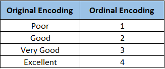
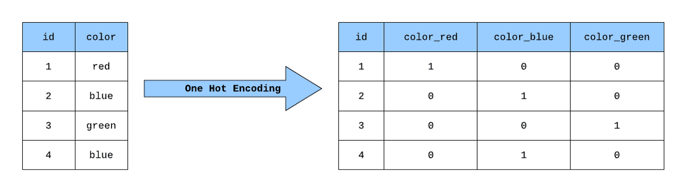

# Encoders
Un **encoder** es una técnica utilizada en aprendizaje automático para convertir datos categóricos en una forma que sea más fácil de procesar por los algoritmos de aprendizaje automático. Los datos categóricos son variables que contienen etiquetas o categorías en lugar de valores numéricos. Los encoders convierten estas etiquetas en valores numéricos para que los algoritmos de aprendizaje automático puedan trabajar con ellos.

Hay varios tipos de encoders que se utilizan comúnmente en aprendizaje automático:
| Tipo de Encoder | Descripción | Introduce orden |
| --- | --- | --- |
| Ordinal Encoder | Codifica las etiquetas categóricas en valores numéricos ordenados | ✅ |
| Label Encoder | Codifica las etiquetas categóricas en valores numéricos | ✖️ |
| One-Hot Encoder | Crea variables dummy para cada categoría | ✖️ |
| Binary Encoder | Codifica las etiquetas categóricas en valores binarios | ✖️ |
| Frequency Encoder | Codifica las etiquetas categóricas en función de su frecuencia | ✖️ |
| Target Encoder | Codifica las etiquetas categóricas en función de la variable objetivo | ✖️ |

[difference-between-ordinalencoder-and-labelencoder](https://www.geeksforgeeks.org/what-is-the-difference-between-ordinalencoder-and-labelencoder/)

## Ordinal Encoder

- **OrdinalEncoder**: Este método es similar a `LabelEncoder` en que también convierte las categorías en números enteros. La diferencia es que `OrdinalEncoder` puede ser aplicado a múltiples columnas a la vez. Ademas permite especificar el orden de las categorías.

## Label Encoder
- **LabelEncoder**: Se utiliza principalmente para convertir variables categóricas en numéricas. Este método asigna a cada categoría única en la columna un valor numérico entero. Sin embargo, `LabelEncoder` se aplica solo a una columna a la vez. Además, no tiene en cuenta el orden de las categorías.

## One-Hot Encoder
Se puede usar pandas o scikit-learn para aplicar el One-Hot Encoder a un conjunto de datos. Aquí hay un ejemplo de cómo se puede hacer con pandas:

