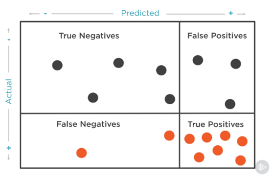
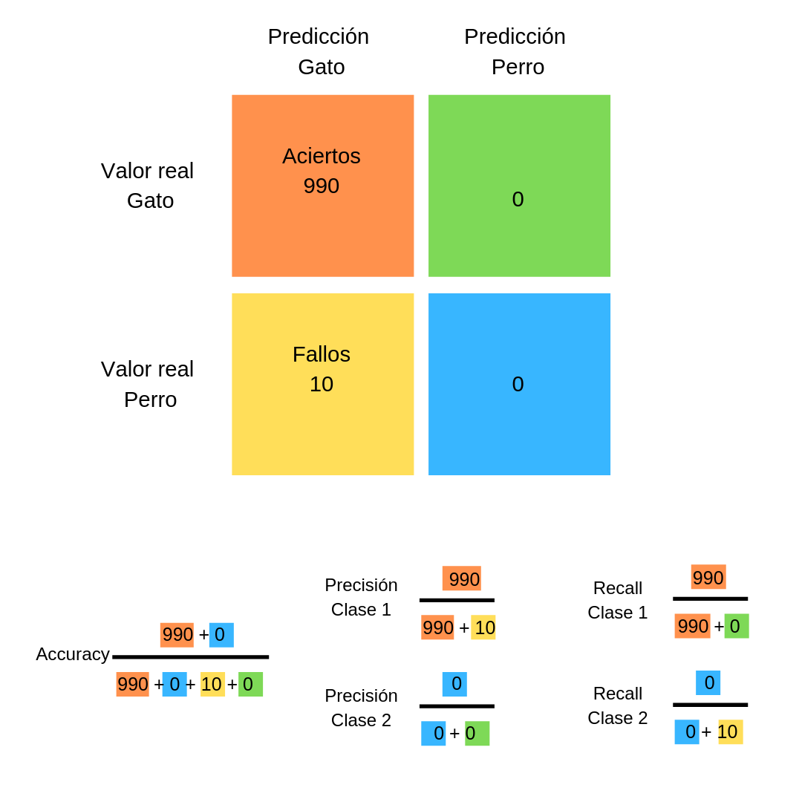

# Métricas de Clasificación Binaria

[VER goggle matrix de confusion](https://developers.google.com/machine-learning/crash-course/classification/thresholding?hl=es-419)
Las métricas de evaluación son medidas utilizadas para evaluar el rendimiento de un modelo de aprendizaje automático. En el caso de los problemas de clasificación en el aprendizaje supervisado, estas métricas nos ayudan a determinar qué tan bien nuestro modelo está haciendo predicciones categóricas, como clasificar un correo electrónico como spam o no spam. [link](https://www.themachinelearners.com/metricas-de-clasificacion/#Precision)

Metricas para la clasificación:

- Accuracy (exactitud).
- Precision (precisión)
- Recall (exhaustividad).
- F1 Score (Valor-F ($F_1$))

Para cada una de las métricas:

- *TP (True Positive):* Son los valores que el algoritmo clasifica como positivos y que realmente son positivos.
- TN (True Negative): Son los valores que el algoritmo clasifica como negativos y que realmente son negativos.
- FP (False Positive): Falsos positivos, es decir, valores que el algoritmo clasifica como positivo cuando realmente son negativos.
- FN (False Negative): Falsos negativos, es decir, valores que el algoritmo clasifica como negativo cuando realmente son positivos.




## Accuracy (Exactitud)

La exactitud es una métrica que mide la proporción de predicciones correctas que realiza el modelo. Se calcula como la proporción de predicciones correctas sobre el total de predicciones realizadas.

$$ Accuracy = \frac{TP + TN}{TP + TN + FP + FN} $$

## Precision (Precisión)

La precisión mide la proporción de predicciones positivas que fueron correctas. Se calcula como la proporción de verdaderos positivos sobre la suma de verdaderos positivos y falsos positivos.

$$ Precision = \frac{TP}{TP + FP} $$

## Recall (Exhaustividad o Sensibilidad)

El Recall de una clase expresa cuan bien puede el modelo detectar a esa clase.

La exhaustividad mide la proporción de positivos reales que fueron clasificados correctamente. Se calcula como la proporción de verdaderos positivos sobre la suma de verdaderos positivos y falsos negativos.

Es la capacidad del modelo para detectar correctamente los positivos verdaderos (clase 1 en este caso)

$$ Recall = \frac{TP}{TP + FN} $$

## Especificidad

La especificidad mide la proporción de negativos reales que fueron clasificados correctamente. Se calcula como la proporción de verdaderos negativos sobre la suma de verdaderos negativos y falsos positivos.

Mide la proporción de verdaderos negativos sobre el total de negativos reales:

(TNR - True Negative Rate): Es la capacidad del modelo para identificar correctamente los negativos verdaderos (clase 0). Se calcula así:

$$ Especificidad = \frac{TN}{TN + FP} $$

## F1 Score (Valor-F ($F_1$))

El valor-F es la media armónica entre la precisión y la exhaustividad. Se calcula como:

$$ F_1 = 2 \cdot \frac{Precision \cdot Recall}{Precision + Recall} $$

Con $F_1$ entre $0$ y $1$, donde $1$ es la mejor puntuación posible.

Tenemos cuatro casos posibles para cada clase:

- **Alta precision y alto recall**: el modelo maneja perfectamente esa clase.
- **Alta precision y bajo recall**: el modelo no detecta la clase muy bien, pero cuando lo hace es altamente confiable.
- Baja precisión y alto recall: La clase detecta bien la clase pero también incluye muestras de otras clases.
- Baja precisión y bajo recall: El modelo no logra clasificar la clase correctamente.

Cuando tenemos un dataset con desequilibrio, suele ocurrir que obtenemos un alto valor de precisión en la clase Mayoritaria y un bajo recall en la clase Minoritaria.

## Macro Avg (Promedio Macro)

El promedio macro es el promedio no ponderado de las métricas por clase. Se calcula sumando las métricas de cada clase y dividiéndolas por el número de clases.

$$\text{Macro Avg} = \frac{1}{N} \sum_{i=1}^{N} \text{Metric}_i $$

donde $( N )$ es el número de clases y $ \text{Metric}_i $  es la métrica (precisión, recall, F1-Score) para la clase $i$ .

## Weighted Avg (Promedio Ponderado)

El promedio ponderado es el promedio de las métricas por clase, ponderado por el número de ocurrencias de cada clase (support).

$$ \text{Weighted Avg} = \frac{1}{\sum_{i=1}^{N} \text{Support}_i} \sum_{i=1}^{N} (\text{Support}_i \cdot \text{Metric}_i) $$

donde  $\text{Support}_i$ es el número de ocurrencias de la clase $ i $ y $ \text{Metric}_i $ es la métrica (precisión, recall, F1-Score) para la clase $ i $.

## Curva ROC (Receiver Operating Characteristic)

La curva ROC es una representación gráfica de la sensibilidad frente a la especificidad para un sistema clasificador binario a medida que se varía el umbral de discriminación. La curva ROC se crea trazando la tasa de verdaderos positivos (TPR) contra la tasa de falsos positivos (FPR) en varios valores de umbral. La AUC (Area Under the Curve) es el área bajo la curva ROC y se utiliza como métrica para comparar diferentes modelos. [link](https://www.youtube.com/watch?v=AcbbkCL0dlo)

## Matriz de Confusión

La matriz de confusión es una tabla que se utiliza para describir el rendimiento de un modelo de clasificación en un conjunto de datos para los que se conoce la verdadera clase. La matriz de confusión tiene dos dimensiones: una dimensión representa las clases reales y la otra dimensión representa las clases predichas por el modelo.

## Ejemplo

_Valores Reales y Predicciones_

- **Valores Reales**: 
  $$[🫑, 🐺, 🫑, 🐺, 🫑, 🐺, 🫑, 🐺, 🫑, 🐺]$$
- **Predicciones**: 
  $$[🫑, 🐺, 🐺, 🐺, 🫑, 🫑, 🫑, 🐺, 🐺, 🐺]$$

_Matriz de Confusión_
|                | Predicción: 🫑 | Predicción: 🐺 |
|----------------|----------------|---------------|
| **Real: 🫑**   | TP <br> 3      | FN <br> 2     |
| **Real: 🐺**   | FP <br> 1      | TN <br> 4     |

```mathematica
          Predicted Positive | Predicted Negative
          --------------------------------------
Actual Positive  |      TP      |      FN      |
          --------------------------------------
Actual Negative  |      FP      |      TN      |

```
_Matriz de Confusión (segun python)_

|               | Predicción (0):🐺 | Predicción (1): 🫑 |
|---------------|-------------------|-------------------|
| Real (0):🐺   | TN <br> 4        | FP <br> 1         |
| Real (1):🫑   | FN <br> 2        | TP <br> 3         |


Interpretación

- **Verdaderos Positivos (TP)**: 3 (El modelo predijo "🫑" correctamente 3 veces).
- **Verdaderos Negativos (TN)**: 4 (El modelo predijo "🐺" correctamente 4 veces).
- **Falsos Positivos (FP)**: 1 (El modelo predijo "🫑" incorrectamente 1 vez).
- **Falsos Negativos (FN)**: 2 (El modelo predijo "🐺" incorrectamente 2 veces).

Métricas:

- **Accuracy**: $$\frac{3 + 4}{3 + 4 + 1 + 2} = 0.7$$
- **Precision**: $$\frac{3}{3 + 1} = 0.75$$
- **Recall**: $$\frac{3}{3 + 2} = 0.6$$
- **F1 Score**: $$2 \cdot \frac{0.75 \cdot 0.6}{0.75 + 0.6} = 0.6667$$

```plaintext
              precision    recall  f1-score   support

     (0) 🐺    0.66         0.8       0.72       6  
     (1) 🫑    0.75         0.6       0.6667     5  

    accuracy                           0.7       11
   macro avg    0.7         0.7       0.6833     11  
weighted avg    0.7         0.7       0.6833     11   
```

# Ejemplo

Claro, te explico cada uno de los términos y métricas que aparecen en el reporte de clasificación y la matriz de confusión:

## Matriz de Confusión

La matriz de confusión muestra el rendimiento del modelo en términos de verdaderos positivos, verdaderos negativos, falsos positivos y falsos negativos.

```plaintext
array([[10773,   438],
       [ 1965,  1299]], dtype=int64)
```

- **10773**: Verdaderos negativos (No predicho como No)
- **438**: Falsos positivos (No predicho como Yes)
- **1965**: Falsos negativos (Yes predicho como No)
- **1299**: Verdaderos positivos (Yes predicho como Yes)

## Reporte de Clasificación

El reporte de clasificación proporciona varias métricas para evaluar el rendimiento del modelo.

```plaintext
              precision    recall  f1-score   support

          No       0.85      0.96      0.90     11211
         Yes       0.75      0.40      0.52      3264

    accuracy                           0.83     14475
   macro avg       0.80      0.68      0.71     14475
weighted avg       0.82      0.83      0.81     14475
```

### Métricas por Clase

- **Precision (Precisión)**: Proporción de verdaderos positivos sobre el total de predicciones positivas.
  
  - `No`: 0.85
  - `Yes`: 0.75

- **Recall (Sensibilidad o Recall)**: Proporción de verdaderos positivos sobre el total de verdaderos positivos y falsos negativos.
  
  - `No`: 0.96
  - `Yes`: 0.40

- **F1-Score**: Media armónica de la precisión y el recall.
  
  - `No`: 0.90
  - `Yes`: 0.52

- **Support**: Número de ocurrencias reales de cada clase en el conjunto de datos.
  
  - `No`: 11211
  - `Yes`: 3264

### Métricas Globales

- **Accuracy (Exactitud)**: Proporción de predicciones correctas sobre el total de predicciones.
  
  - `0.83`

- **Macro Avg (Promedio Macro)**: Promedio no ponderado de las métricas por clase.
  
  - `Precision`: 0.80
  - `Recall`: 0.68
  - `F1-Score`: 0.71

- **Weighted Avg (Promedio Ponderado)**: Promedio ponderado de las métricas por clase, ponderado por el número de ocurrencias de cada clase.
  
  - `Precision`: 0.82
  - `Recall`: 0.83
  - `F1-Score`: 0.81

Estas métricas te ayudan a entender cómo se desempeña tu modelo en términos de precisión, sensibilidad y balance entre ambas, tanto a nivel de cada clase como globalmente.

Entiendo, vamos a desglosar cómo se calculan las métricas para las filas `No` y `Yes` en el reporte de clasificación utilizando la matriz de confusión que proporcionaste.

### Matriz de Confusión

```plaintext
array([[10773,   438],
       [ 1965,  1299]], dtype=int64)
```

### Desglose de la Matriz de Confusión

- **10773**: Verdaderos negativos (No predicho como No)
- **438**: Falsos positivos (No predicho como Yes)
- **1965**: Falsos negativos (Yes predicho como No)
- **1299**: Verdaderos positivos (Yes predicho como Yes)

### Cálculo de las Métricas para `No`

- **Precision (Precisión)**:
  $$ \text{Precision}_{No} = \frac{TP_{No}}{TP_{No} + FP_{No}} = \frac{10773}{10773 + 438} = \frac{10773}{11211} \approx 0.96
  $$

- **Recall (Sensibilidad o Recall)**:
  $$ \text{Recall}_{No} = \frac{TP_{No}}{TP_{No} + FN_{No}} = \frac{10773}{10773 + 1965} = \frac{10773}{12738} \approx 0.85 $$

- **F1-Score**:
  $$ \text{F1-Score}_{No} = 2 \cdot \frac{\text{Precision}_{No} \cdot \text{Recall}_{No}}{\text{Precision}_{No} + \text{Recall}_{No}} = 2 \cdot \frac{0.96 \cdot 0.85}{0.96 + 0.85} \approx 0.90 $$

- **Support**:
  
  $$
  \text{Support}_{No} = 11211
  $$

### Cálculo de las Métricas para `Yes`

- **Precision (Precisión)**:
  
  $$
  \text{Precision}_{Yes} = \frac{TP_{Yes}}{TP_{Yes} + FP_{Yes}} = \frac{1299}{1299 + 1965} = \frac{1299}{3264} \approx 0.40
  $$

- **Recall (Sensibilidad o Recall)**:
  
  $$
  \text{Recall}_{Yes} = \frac{TP_{Yes}}{TP_{Yes} + FN_{Yes}} = \frac{1299}{1299 + 438} = \frac{1299}{1737} \approx 0.75
  $$

- **F1-Score**:
  
  $$
  \text{F1-Score}_{Yes} = 2 \cdot \frac{\text{Precision}_{Yes} \cdot \text{Recall}_{Yes}}{\text{Precision}_{Yes} + \text{Recall}_{Yes}} = 2 \cdot \frac{0.40 \cdot 0.75}{0.40 + 0.75} \approx 0.52
  $$

- **Support**:
  
  $$
  \text{Support}_{Yes} = 3264
  $$

### Resumen

- **No**:
  
  - Precision: 0.96
  - Recall: 0.85
  - F1-Score: 0.90
  - Support: 11211

- **Yes**:
  
  - Precision: 0.40
  - Recall: 0.75
  - F1-Score: 0.52
  - Support: 3264

Estas métricas se calculan utilizando las fórmulas mencionadas anteriormente y los valores de la matriz de confusión.

## Ejemplo 2:

```
             precision    recall  f1-score   support

          0       0.81      0.88      0.84     11211
          1       0.42      0.30      0.35      3264

   accuracy                           0.75     14475
  macro avg       0.62      0.59      0.60     14475
weighted avg       0.72      0.75      0.73     14475
```

En el ejemplo que proporcionas, podemos calcular tanto el **recall** como la **especificidad** basándonos en las métricas proporcionadas.

Recuerda:

- **Recall** es la capacidad de detectar los positivos verdaderos, es decir, la fracción de los positivos correctamente predichos.
- **Especificidad** es la capacidad de detectar los negativos verdaderos, es decir, la fracción de los negativos correctamente predichos.

Dado que no tenemos explícitos los valores de TP, TN, FP, y FN en tu tabla, usaremos la información de **recall** para la clase 1 y podemos deducir la **especificidad** a partir de los datos de la clase 0.

### Recall de la clase 1 (Positivos - "Lloverá"):

El recall ya está dado directamente en tu tabla para la clase 1:

$
\text{Recall clase 1} = 0.30
$

Esto significa que el modelo detecta correctamente el 30% de los días en los que lloverá (clase 1). En otras palabras, de todos los días en los que llovió, el modelo predijo correctamente el 30%.

### Especificidad (Clase 0 - No lloverá):

Para calcular la **especificidad**, usamos la clase 0 (los negativos), ya que la especificidad mide cuántos días el modelo detectó correctamente que **no** iba a llover.

Sabemos que el **recall** de la clase 0 es 0.88. Este dato está en tu tabla bajo el encabezado **recall** para la clase 0.

Para calcular la **especificidad**, en este caso, sería el **recall** de la clase 0, porque la clase 0 es la clase negativa en un problema binario. Por lo tanto, podemos decir:

$
\text{Especificidad} = \text{Recall clase 0} = 0.88
$

## Ejemplo 3: 3x3

Para calcular la precisión (precision) de la clase cero a partir de la matriz de confusión, puedes usar la siguiente fórmula:

### Fórmula de Precisión

$$ \text{Precisión} = \frac{\text{TP}}{\text{TP} + \text{FP}} $$

Donde:
- **TP (True Positive)**: Verdaderos positivos, que son las predicciones correctas de la clase cero.
- **FP (False Positive)**: Falsos positivos, que son las predicciones incorrectas de la clase cero (casos que no son cero pero fueron predichos como cero).

### Identificación de TP y FP

En la matriz que proporcionaste:


|                        | Predicción 0 | Predicción 1 | Predicción 2 |
|------------------------|---------------------|-------------------|---------------------|
| **Real 0**      |    13    |     1     |     1     | 
| **Real 1**      |    0     |    15     |     3     | 
| **Real 2**      |    4     |     1     |    13     |


- **TP (True Positive) para la clase 0**: Es el valor en la fila de "Real 0" y la columna de "Predicción 0", que es **13**.
- **FP (False Positive) para la clase 0**: Es la suma de todos los valores en la columna de "Predicción 0", excepto el de "Real 0". Es decir:
  - De la fila de "Real 1": **0**
  - De la fila de "Real 2": **4**

Por lo tanto:

$$ \text{FP} = 0 + 4 = 4 $$

### Cálculo de la Precisión

Ahora puedes calcular la precisión para la clase cero:

$$ \text{Precisión} = \frac{TP}{TP + FP} = \frac{13}{13 + 4} = \frac{13}{17} \approx 0.7647 $$

### Resultado

La precisión para la clase cero es aproximadamente **0.7647** o **76.47%**.
### Resumen:

- **Recall (clase 1 - Lloverá)** = 0.30 (detecta correctamente el 30% de los días con lluvia).
- **Especificidad (clase 0 - No lloverá)** = 0.88 (detecta correctamente el 88% de los días sin lluvia).

Estos valores muestran que el modelo es bueno para detectar los días sin lluvia, pero tiene dificultades para detectar los días en que sí lloverá.

# Métricas de Regresión

1. Raíz del Error Cuadrático Medio (RMSE)
2. Error Cuadrático Medio (MSE)
3. Error Absoluto Medio (MAE)
4. Coeficiente de Determinación ($R^2$)

Para cada una de las métricas:

- $n$ es el número de observaciones.
- $y_i$ es el valor real.
- $\hat{y}_i$ es el valor predicho.

## Raíz del Error Cuadrático Medio (RMSE)

La Raíz del Error Cuadrático Medio (RMSE) es una métrica que mide la raíz cuadrada de la media de los cuadrados de los errores entre los valores predichos y los valores reales. Cuanto menor sea el RMSE, mejor será el modelo.

$$ RMSE = \sqrt{\frac{1}{n} \cdot \sum_{i=1}^{n} (y_i - \hat{y}_i)^2} $$
donde:

## Error Cuadrático Medio (MSE)

El Error Cuadrático Medio (MSE) es una métrica que mide el promedio de los cuadrados de los errores entre los valores predichos y los valores reales. Cuanto menor sea el MSE, mejor será el modelo.

$$ MSE = \frac{1}{n} \cdot \sum_{i=1}^{n} (y_i - \hat{y}_i)^2 $$

## Error Absoluto Medio (MAE)

El Error Absoluto Medio (MAE) es una métrica que mide el promedio de los valores absolutos de los errores entre los valores predichos y los valores reales. Cuanto menor sea el MAE, mejor será el modelo.

$$ MAE = \frac{1}{n} \cdot \sum_{i=1}^{n} |y_i - \hat{y}_i| $$

## Coeficiente de Determinación ($R^2$)

El Coeficiente de Determinación ($R^2$) es una métrica que indica la proporción de la varianza en la variable dependiente que es predecible a partir de la variable independiente. Cuanto más cercano sea el valor de $R^2$ a 1, mejor será el modelo.

$$ R^2 = 1 - \frac{\sum_{i=1}^{n} (y_i - \hat{y}_i)^2}{\sum_{i=1}^{n} (y_i - \bar{y})^2} $$

## Cuando usar cada métrica

- **RMSE**: Es sensible a los valores atípicos y penaliza los errores grandes.
- **MSE**: Es sensible a los valores atípicos y penaliza los errores grandes.
- **MAE**: Es menos sensible a los valores atípicos y no penaliza tanto los errores grandes.
- **$R^2$**: Mide la proporción de la varianza explicada por el modelo. Cuanto más cercano a 1, mejor es el modelo.

# [Curva Roc](roc_curve.md)
