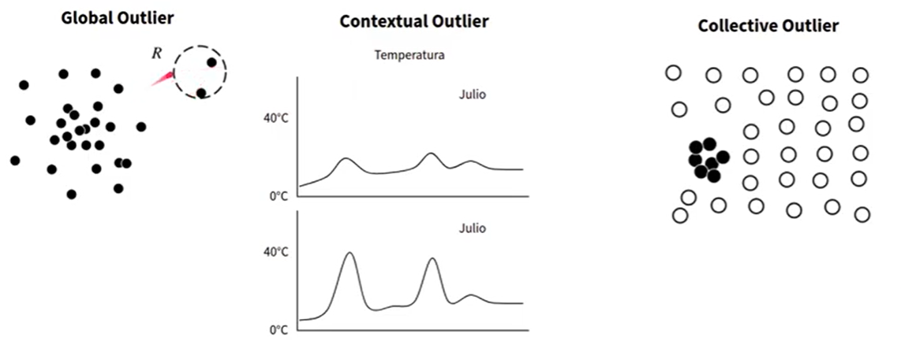

# Outliers

Tipos de outliers:
- **Univariados**: Se basan en una sola variable.
- **Multivariados**: Se basan en múltiples variables.

# Métodos Univariados
## IQR (Rango Intercuartílico)
Se basa en el rango intercuartílico. Se calcula como la diferencia entre el tercer cuartil y el primer cuartil. Los outliers son aquellos valores que están por debajo de $Q1 - 1.5 \cdot IQR$ o por encima de $Q3 + 1.5 \cdot IQR$.

$$ IQR = Q3 - Q1 $$
$$ Lower = Q1 - 1.5 \cdot IQR $$
$$ Upper = Q3 + 1.5 \cdot IQR $$

Donde:
- $IQR$ es el rango intercuartílico.
- $Q1$ es el primer cuartil (25%).
    $$ Q1 = \frac{1 \cdot (n + 1)}{4} $$
- $Q2$ es el tercer cuartil (50%).
    $$ Q2 = \frac{2 \cdot (n + 1)}{4} $$
- $Q3$ es el tercer cuartil (75%).
    $$ Q3 = \frac{3 \cdot (n + 1)}{4} $$

### Z-Score
Se basa en la desviación estándar. Se calcula como la diferencia entre el valor y la media dividido por la desviación estándar. Los outliers son aquellos valores que están por debajo de $-3$ o por encima de $3$.

$$ Z_i = \frac{X_i - \mu}{\sigma} $$

Donde:
- $Z_i$ es el Z-Score del valor $X_i$.
- $X_i$ es el valor original.

## Z-Score Modificado
Se basa en la desviación estándar. Se calcula como la diferencia entre el valor y la media dividido por la desviación estándar. Los outliers son aquellos valores que están por debajo de $-3.5$ o por encima de $3.5$.

La media de la muestra y la desviación estándar de la muestra, pueden verse
afectados por los valores extremos presentes en los datos

$$ M_i = \frac{0.6745 \cdot (x_i - \mu)}{MAD} $$
Donde:
- $M_i$ es el Z-Score modificado del valor $X_i$.
- $x_i$ es el valor original.
- $\mu$ es la media de la muestra.
- $MAD$ es la desviación absoluta de la mediana.
    $$ MAD = median(|x_i - median(x)|) $$

1. Regla de oro: valores mayores a 3.5 son considerados outliers
2. Es la mediana de los desvíos absolutos respecto de la mediana.
3. Para hacer MAD comparable con la desviación estándar, se normaliza por 0.6745

¡Claro! Aquí tienes un ejemplo de cómo utilizar el Z-Score modificado para la detección de outliers:

## Ejemplo
Supongamos que tenemos el siguiente conjunto de datos de alturas (en cm) de un grupo de personas:
$$[ 160, 162, 165, 167, 170, 172, 175, 177, 180, 250 ]$$

1. **Calcular la mediana**:
   $$[ \text{Mediana} = 170 ]$$

2. **Calcular la desviación absoluta de la mediana (MAD)**:
   $$[ MAD = \text{mediana}(|x_i - \text{mediana}(x)|) ]$$
   $$[ MAD = \text{mediana}(|160 - 170|, |162 - 170|, \ldots, |250 - 170|) ]$$
   $$[ MAD = \text{mediana}(10, 8, 5, 3, 0, 2, 5, 7, 10, 80) ]$$
   $$[ MAD = 7 ]$$

3. **Calcular el Z-Score modificado para cada valor**:
   $$[ M_i = \frac{0.6745 \cdot (x_i - \mu)}{MAD} ]$$
   Donde (mu) es la media de la muestra.

   Para simplificar, usaremos la mediana en lugar de la media:
   $$[ M_i = \frac{0.6745 \cdot (x_i - 170)}{7} ]$$

   Calculamos (M_i) para cada valor:
   $$[ M_{160} = \frac{0.6745 \cdot (160 - 170)}{7} = -0.964 ]$$
   $$[ M_{162} = \frac{0.6745 \cdot (162 - 170)}{7} = -0.771 ]$$
   $$[ M_{165} = \frac{0.6745 \cdot (165 - 170)}{7} = -0.482 ]$$
   $$[ M_{167} = \frac{0.6745 \cdot (167 - 170)}{7} = -0.289 ]$$
   $$[ M_{170} = \frac{0.6745 \cdot (170 - 170)}{7} = 0 ]$$
   $$[ M_{172} = \frac{0.6745 \cdot (172 - 170)}{7} = 0.193 ]$$
   $$[ M_{175} = \frac{0.6745 \cdot (175 - 170)}{7} = 0.482 ]$$
   $$[ M_{177} = \frac{0.6745 \cdot (177 - 170)}{7} = 0.675 ]$$
   $$[ M_{180} = \frac{0.6745 \cdot (180 - 170)}{7} = 0.964 ]$$
   $$[ M_{250} = \frac{0.6745 \cdot (250 - 170)}{7} = 7.714 ]$$

4. **Identificar outliers**:
   Según la regla de oro, valores mayores a 3.5 o menores a -3.5 son considerados outliers. En este caso, el valor 250 tiene un Z-Score modificado de 7.714, lo que lo clasifica como un outlier.

## Criterios para Elegir un Método
La elección entre IQR, Z-Score y Z-Score modificado para la detección de outliers en un análisis univariado depende de varios factores. Aquí te explico los criterios para elegir cada uno y cuándo detener el proceso de análisis:

Criterios para Elegir un Método

1. **IQR (Interquartile Range)**:
   - **Ventajas**: Es robusto frente a outliers porque se basa en los cuartiles (Q1 y Q3) y no en la media o la desviación estándar.
   - **Uso**: Ideal para datos que no siguen una distribución normal o cuando se espera que haya muchos outliers.
   - **Criterio**: Los valores que están por debajo de \(Q1 - 1.5 \times IQR\) o por encima de \(Q3 + 1.5 \times IQR\) son considerados outliers.
   - **Consideración**: Si eliminas los outliers encontrados, pueden aparecer nuevos outliers en el siguiente análisis. Es importante revisar iterativamente.

2. **Z-Score**:
   - **Ventajas**: Es fácil de calcular y entender. Útil cuando los datos siguen una distribución normal.
   - **Uso**: Adecuado para datos distribuidos normalmente.
   - **Criterio**: Los valores con un Z-Score menor que -3 o mayor que 3 son considerados outliers.
   - **Consideración**: La media y la desviación estándar pueden estar influenciadas por outliers, lo que puede afectar la precisión del Z-Score.

3. **Z-Score Modificado**:
   - **Ventajas**: Más robusto que el Z-Score estándar porque utiliza la mediana y la desviación absoluta de la mediana (MAD).
   - **Uso**: Ideal para datos con outliers extremos o cuando la distribución no es normal.
   - **Criterio**: Los valores con un Z-Score modificado menor que -3.5 o mayor que 3.5 son considerados outliers.
   - **Consideración**: Similar al Z-Score, pero menos sensible a los outliers iniciales.

### Cuándo Detener el Proceso de Análisis

1. **Iteración**: Después de eliminar los outliers identificados, es recomendable volver a calcular los estadísticos (media, desviación estándar, cuartiles) y repetir el proceso de detección. Esto se hace hasta que no se identifiquen nuevos outliers significativos.
   
2. **Estabilidad**: Detén el proceso cuando los estadísticos se estabilicen y no se detecten nuevos outliers en iteraciones sucesivas.

3. **Impacto en el Modelo**: Si estás utilizando estos métodos para preparar datos para un modelo de machine learning, detén el proceso cuando la eliminación de outliers no mejore significativamente el rendimiento del modelo.

# Métodos Multivariados
## Distancia de Mahalanobis
La **distancia de Mahalanobis** es una medida que determina qué tan lejos está un punto de un conjunto de puntos, tomando en cuenta no solo la distancia euclidiana, sino también la distribución del conjunto de datos. Se utiliza para identificar **outliers** (valores atípicos) en un conjunto de datos multivariado.

A diferencia de la distancia euclidiana, que solo mide distancias lineales, la distancia de Mahalanobis ajusta la medición según la dispersión de los datos, es decir, considera la **covarianza** entre las variables. Esto significa que la distancia de un punto a la media depende de la correlación entre las variables, lo que permite detectar outliers en datos multivariados de manera más precisa.

### Fórmula de la Distancia de Mahalanobis para outliers:
$$D_M(\vec x) = \sqrt{(\vec x - \vec \mu)^T \cdot \Sigma^{-1} \cdot (\vec x - \vec \mu)}$$
Donde:
- $\vec x$ es el vector de valores de la observación.$ R^{1 \times n}$
- $\vec \mu$ es el vector de medias del conjunto de datos.  $ R^{1 \times n}$
- $\Sigma^{-1}$ es la inversa de la matriz de covarianza de los datos. $ R^{n \times n}$

### Identificación de Outliers
Una vez calculada la distancia de Mahalanobis para cada observación, los valores que superan un cierto umbral por ejemplo, un valor crítico basado en la distribución \($\chi^2$) son considerados **outliers**.

Este enfoque es especialmente útil en datasets multivariados donde los outliers no se detectan fácilmente con medidas univariadas.

## Local Outlier Factor (LOF)
Es un algoritmo utilizado para la detección de anomalías en datos no supervisados. Su objetivo es identificar puntos de datos que tienen una densidad local significativamente menor en comparación con sus vecinos cercanos¹².

### ¿Cómo Funciona?
El LOF mide la **desviación de la densidad local** de un punto de datos con respecto a sus vecinos más cercanos. La idea principal es que los outliers son aquellos puntos que están en regiones de baja densidad en comparación con sus vecinos. Aquí tienes un resumen del proceso:

1. **Densidad Local**: Se calcula la densidad local de cada punto de datos utilizando sus \(k\)-vecinos más cercanos.
2. **Factor de Alcance Local**: Se compara la densidad local de un punto con la densidad local de sus vecinos. Si un punto tiene una densidad mucho menor que sus vecinos, se considera un outlier.
3. **Puntuación LOF**: El algoritmo asigna una puntuación de outlier a cada punto de datos. Los puntos con puntuaciones más altas son considerados outliers.

### Fórmula
La puntuación LOF de un punto (i) se calcula como:
$$LOF(i) = \frac{\sum_{j \in N_k(i)} \frac{lrd(j)}{lrd(i)}}{|N_k(i)|}$$
Donde:
- $(N_k(i))$ es el conjunto de los \(k\)-vecinos más cercanos de \(i\).
- $(lrd(i))$ es la densidad de alcance local de \(i\), que se calcula como la inversa de la distancia promedio de \(i\) a sus vecinos.

### Aplicaciones
El LOF es útil en diversas aplicaciones, como:
- Detección de fraudes.
- Análisis de redes.
- Monitoreo de sistemas.
- Análisis de datos de sensores.
