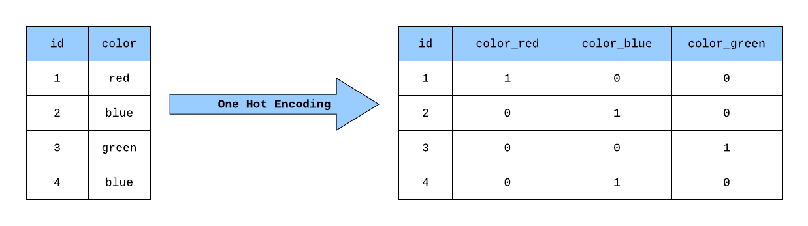
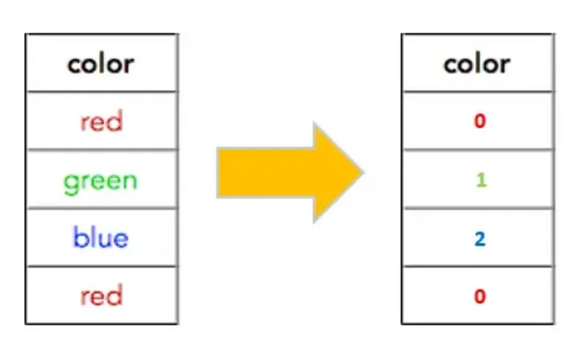
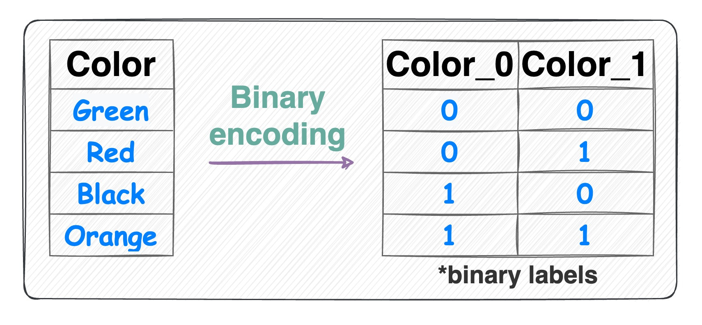

# Tipos de datos faltantes
## Missing completely at random (MCAR)
Los valores faltantes no dependen de ninguna variable observada o no observada. Es decir, no hay relación entre los datos faltantes y cualquier otro valor o variable.- La probabilidad de que un valor falte es la misma para todas las observaciones.

## Missing Not at Random (MNAR)dddd
Ejemplo: Se relaiza una encuesta de ingresos y los más ricos no quieren responder determinadas preguntas. La probabilidad de que falte un valor depende de la variable no observada.

## Missing at Random (MAR)
La probabilidad de que falte un valor depende de alguna otra variable observada.

# Encodings
## One Hot Encoding
Se crea una columna por cada categoría y se asigna un 1 si la observación pertenece a esa categoría y un 0 si no.

nota: eliminar la última columna dado que es redundante.

## Label Encoding
Se asigna un número a cada categoría. No es recomendable para modelos de regresión lineal.

## Binary Encoding

# Normalización
## Min-Max Scaling
Se escala el valor de la variable entre 0 y 1.

## Z-Score Normalization

# [Limpieza de Datos](Limpieza_Datos.md)
# [Feature Engineering](Feature_Engineering.md)

# [Machine Learning](Machine_Learning.md)

# [Encoders](Encoders.md)