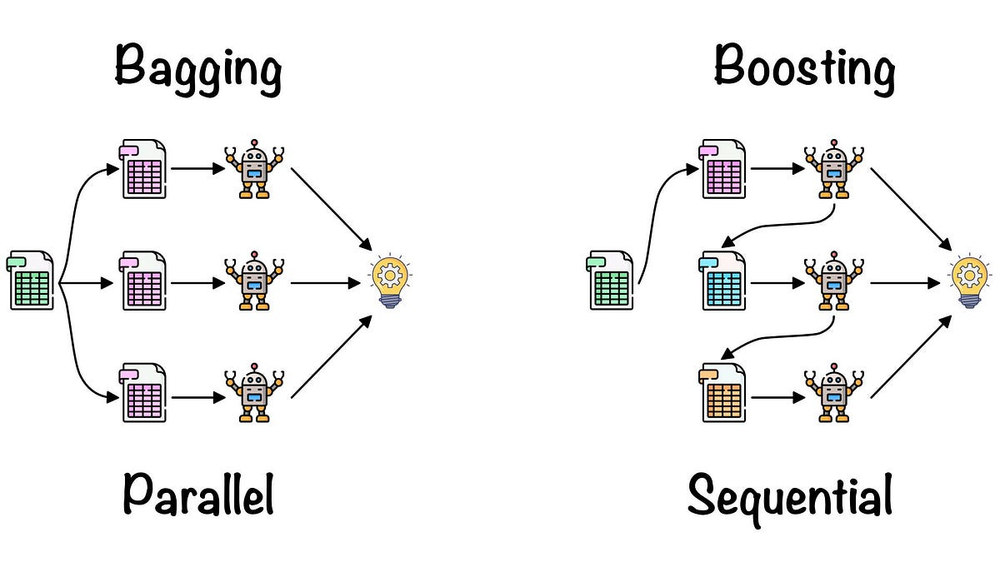
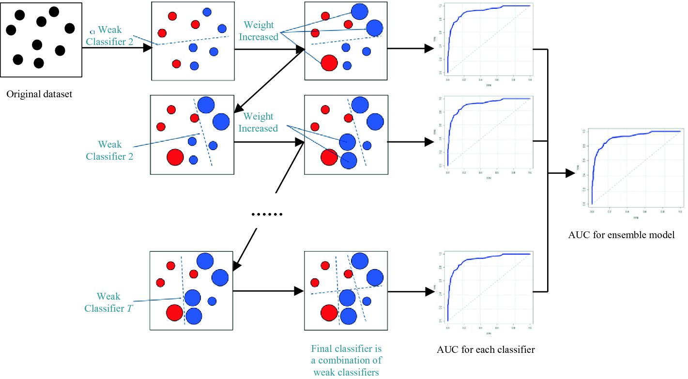
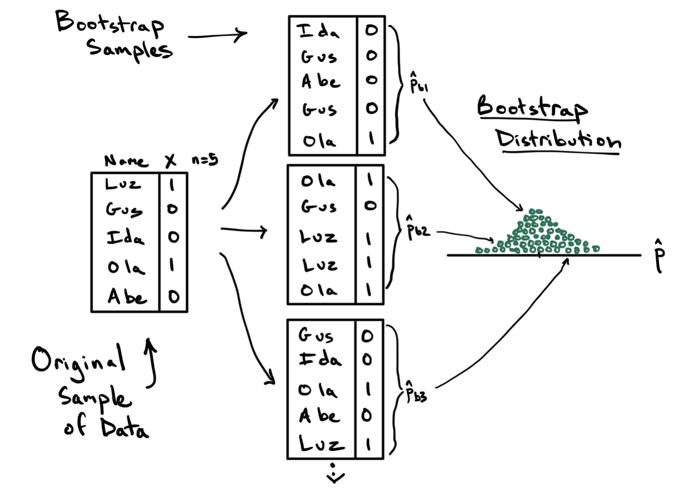

# Ensemble Learning

## Bagging
El **Bagging** (Bootstrap Aggregating) Es una técnica que consiste en construir nuevos conjuntos de entrenamiento usando bootstrap (muestras aleatorias con reemplazo) para entrenar distintos modelos, y luego combinarlos.

Bagging toma el promedio/votación.

Algunos modelos que utilizan Bagging son:
| algoritmo | clasificacion | regresion |
| --- | --- | --- |
| [Random Forest](random_forest.md) | ✅ | ✅ |
| Extra Trees | ✅ | ✅ |

### Características
- Disminuye la varianza en nuestro modelo final
- Muy efectivo en conjuntos de datos con varianza alta
- Puede reducir el overfitting
- Puede reducir el ruido de los outliers(porque no aparecen en todos los datasets)
- Puede mejorar levemente con el voto ponderado

## Boosting
El **Boosting** es una técnica de ensamblado que combina múltiples modelos débiles para crear un modelo fuerte. A diferencia del Bagging, donde los modelos se entrenan de forma independiente, en Boosting los modelos se entrenan secuencialmente, y cada modelo se enfoca en corregir los errores de los modelos anteriores.

Boosting no necesariamente usa bootstrap, pero sí utiliza pesos para ajustar la importancia de las observaciones en cada iteración, que es un enfoque diferente.

Pondera los modelos según su desempeño.

Algunos modelos que utilizan Boosting son:
| algoritmo | clasificacion | regresion |
| --- | --- | --- |
| AdaBoost | ✅ | ✅ |
| Gradient Boosting Machine (GBM) | ✅ | ✅ |
| XGBoost | ✅ | ✅ |
| LightGBM | ✅ | ✅ |
| CatBoost | ✅ | ✅ |

# Bootstrapping
El **bootstrapping** (o bootstrap) es un método de remuestreo propuesto por Bradley Efron en 1979. Se utiliza en estadística para aproximar la distribución en el muestreo de un estadístico. 

Este método se usa frecuentemente para aproximar el sesgo o la varianza de un análisis estadístico, así como para construir intervalos de confianza o realizar contrastes de hipótesis sobre parámetros de interés. En la mayor parte de los casos no pueden obtenerse expresiones cerradas para las aproximaciones bootstrap y por lo tanto es necesario obtener remuestras en un ordenador para poner a prueba el método.

El proceso de utilización de Bootstrap Statistics en estadística consta de los siguientes pasos:

1. Obtener una muestra de datos de la población de interés.
2. Generar múltiples muestras bootstrap a partir de la muestra original. Esto se hace tomando una muestra aleatoria con reemplazo del conjunto de datos original.
3. Calcular el estadístico de interés para cada una de las muestras bootstrap generadas.
4. Utilizar las estadísticas calculadas en las muestras bootstrap para estimar el sesgo, la varianza y otros aspectos de interés.
5. Obtener intervalos de confianza y realizar pruebas de hipótesis basados en los resultados obtenidos.

**Ejemplo de Bootstrapping**:
1. **Selecciona tu dataset**: Supongamos que tienes un dataset original con 100 filas y 5 columnas.

2. **Define la estadística de interés**: Digamos que quieres estimar la media de una de las columnas.

3. **Genera muestras bootstrap**:
   - **Número de muestras**: Aquí te refieres a cuántas muestras bootstrap vas a crear. Por ejemplo, decides crear **1000 muestras**. 
   - **Tamaño de las muestras**: Cada muestra tendrá el mismo número de filas que el dataset original, es decir, **100 filas**, y usarás **todas las columnas** (sin duplicarlas).

4. **Realiza el remuestreo**:
   - Para cada una de las 1000 muestras, seleccionas **100 filas con reemplazo**. Esto significa que al seleccionar, algunas filas pueden aparecer más de una vez y otras pueden no aparecer en absoluto.

**Relación con el Aprendizaje Automático**:
El bootstrapping es fundamental en el aprendizaje automático, especialmente en los métodos de conjunto como Bagging y Random Forests. En estos métodos, varios modelos se entrenan por separado en muestras de bootstrap de los datos de entrenamiento, y sus predicciones se combinan para hacer la predicción final. Esto mejora la estabilidad y precisión de los algoritmos de aprendizaje automático.

Además, el bootstrapping permite cuantificar la incertidumbre asociada con varios modelos de aprendizaje automático y sus parámetros. Es especialmente útil cuando la distribución teórica de una estadística de interés es complicada o desconocida.
