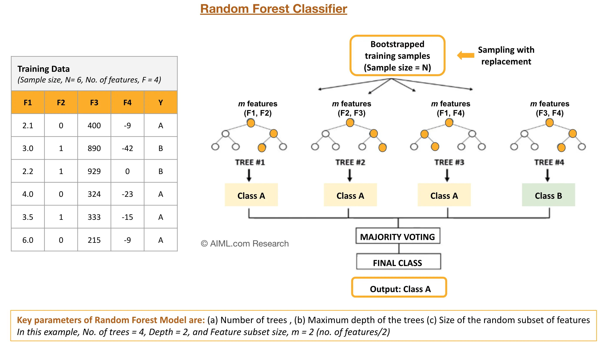

# Random Forest
El **Random Forest** es un algoritmo de aprendizaje automático que se basa en la técnica de Bagging y utiliza un conjunto de árboles de decisión para realizar predicciones. Cada árbol se entrena en una muestra de bootstrap de los datos de entrenamiento y se combina para hacer la predicción final. Esto mejora la estabilidad y precisión del modelo, reduciendo la varianza y el sobreajuste.

Procedimiento:
1. Se selcionan $m$ características (columnas) aleatorias del dataset original (sin reemplazo).
2. Cada arbol (sample) tiene la misma catidad de filas que el dataset original, pero con filas repetidas al azar.
3. Se entrena un árbol de decisión en cada una de las muestras bootstrap.

## Parámetros en sklearn
- **Hyperparámetro**: En la biblioteca ``sklearn``, hay un parámetro llamado ``bootstrap``, que puedes ajustar. Este parámetro se utiliza para indicar si deseas que se realice el muestreo con reemplazo (que es lo estándar en Random Forest). Por defecto, este parámetro está configurado como ``True``, lo que significa que se aplica el muestreo con reemplazo.

- **Número de Árboles**: También puedes ajustar el parámetro ``n_estimators``, que indica cuántos árboles deseas construir en el bosque. Por ejemplo, puedes establecer ``n_estimators=100`` para crear 100 árboles.

## Características
- Disminuye la varianza en nuestro modelo final
- Muy efectivo en conjuntos de datos con varianza alta
- Puede reducir el overfitting
- Puede reducir el ruido de los outliers(porque no aparecen en todos los datasets)
- Puede mejorar levemente con el voto ponderado