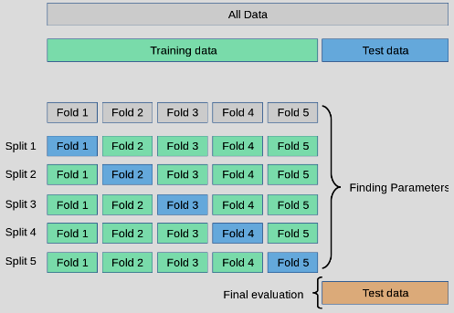
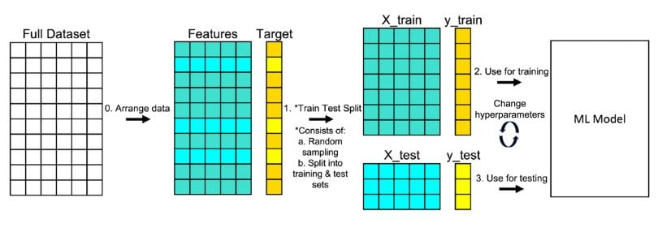

#  Model selection and evaluation
**k-fold Cross Validation**: Es el concepto general de dividir los datos en k particiones y usarlas para validar un modelo. 





```python
sklearn.model_selection.train_test_split(*arrays, test_size=None, train_size=None, random_state=None, shuffle=True, stratify=None)
```



### **GridSearchCV y RandomizedSearchCV** con k-fold Cross Validation
Tanto **`GridSearchCV`** como **`RandomizedSearchCV`** usan **k-fold Cross Validation** como parte de su funcionamiento para optimizar los hiperparámetros del modelo.

- `cross_val_score` es una de las formas de implementarlo. **GridSearchCV** y **RandomizedSearchCV** usan **k-fold Cross Validation** como parte de su proceso de búsqueda de hiperparámetros, pero añaden el componente de optimización.

- **`GridSearchCV`**:
  - Realiza una búsqueda exhaustiva sobre un conjunto de hiperparámetros.
  - Para cada combinación de hiperparámetros, se entrena el modelo varias veces usando **k-fold Cross Validation** (el valor de `k` es determinado por el parámetro `cv`).
  - Después de evaluar cada combinación en los distintos folds, selecciona la combinación de hiperparámetros que tenga la mejor métrica promedio (por ejemplo, precisión, F1, etc.).

- **`RandomizedSearchCV`**:
  - Es similar a `GridSearchCV`, pero en lugar de probar todas las combinaciones de hiperparámetros, selecciona aleatoriamente un número limitado de combinaciones.
  - También utiliza **k-fold Cross Validation** para evaluar el rendimiento de cada combinación de hiperparámetros.
  
Ambos métodos, al definir el parámetro `cv`, controlan cuántos folds se utilizarán en la validación cruzada.

**Ejemplo de uso de `GridSearchCV` con k-fold Cross Validation:**
```python
from sklearn.model_selection import GridSearchCV
from sklearn.tree import DecisionTreeClassifier

# Definir el modelo
tree = DecisionTreeClassifier()

# Definir los parámetros a optimizar
param_grid = {
    'max_depth': [None, 5, 10, 15],
    'min_samples_split': [2, 5, 10]
}

# Configurar GridSearchCV con 5-fold cross-validation
grid_search = GridSearchCV(tree, param_grid, cv=5, scoring='accuracy')

# Ajustar el modelo
grid_search.fit(X, y)

# Mejor modelo
print(f"Mejores parámetros: {grid_search.best_params_}")
```

### **cross_val_score** y k-fold Cross Validation

- **`cross_val_score`** es una función que realiza validación cruzada directamente. Internamente, implementa **k-fold Cross Validation**.
- Puedes usar esta función para evaluar el rendimiento de un modelo de manera simple sin hacer optimización de hiperparámetros. Lo que hace es dividir los datos en **k** folds, entrenar y evaluar el modelo en cada fold, y luego devolver las puntuaciones obtenidas para cada partición.

**Ejemplo de `cross_val_score`:**
```python
from sklearn.model_selection import cross_val_score
from sklearn.tree import DecisionTreeClassifier

# Definir el modelo
tree = DecisionTreeClassifier()

# Evaluar con k-fold cross-validation
scores = cross_val_score(tree, X, y, cv=5, scoring='accuracy')

# Puntuaciones de cada fold
print(f"Puntuaciones: {scores}")
# Promedio de puntuaciones
print(f"Promedio de precisión: {scores.mean()}")
```

- **`cross_val_score`**: Es una implementación directa de k-fold Cross Validation. Solo se encarga de evaluar un modelo usando validación cruzada. No realiza optimización de hiperparámetros.

### Resumen

- **Sí**, tanto `GridSearchCV` como `RandomizedSearchCV` utilizan **k-fold Cross Validation** para evaluar cada combinación de hiperparámetros.
- **`cross_val_score`** es una función que implementa **k-fold Cross Validation** de forma directa para evaluar un modelo sin optimización de hiperparámetros.
- La principal diferencia es que `GridSearchCV` y `RandomizedSearchCV` buscan los mejores hiperparámetros, mientras que `cross_val_score` solo evalúa el rendimiento de un modelo con los hiperparámetros dados.