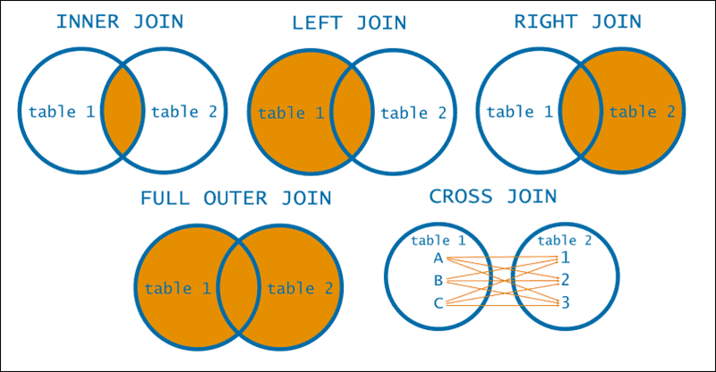

# Python
En Python, `*args` y `**kwargs` son convenciones utilizadas para permitir que una función acepte un número variable de argumentos. 

- `*args`: Se utiliza para pasar un número variable de argumentos no clave a una función. Dentro de la función, puedes usar `args` como una tupla de los argumentos pasados.

```python
def sumar(*args):
    return sum(args)

print(sumar(1, 2, 3, 4))  # Devuelve 10
```

- `**kwargs`: Se utiliza para pasar un número variable de argumentos clave-valor a una función. Dentro de la función, puedes usar `kwargs` como un diccionario de los argumentos pasados. Los `**kwargs` siempre son clave-valor. `kwargs` es un diccionario que mapea cada argumento clave (el nombre del argumento) a su valor.

```python
def presentar(**kwargs):
    for clave, valor in kwargs.items():
        print(f"{clave}: {valor}")

presentar(nombre="Juan", edad=30)  
# Imprime:
# nombre: Juan
# edad: 30

presentar(**{"nombre": "Juan", "edad": 30, "ciudad": "Madrid"})
# Imprime:
# nombre: Juan
# edad: 30
# ciudad: Madrid
```

**Operador `*` y `**`**
- `*` se utiliza para desempaquetar elementos de una lista o de un objeto iterable.
- `**` se utiliza para desempaquetar elementos de un diccionario en argumentos clave-valor.

El código `presentar(**{"nombre": "Juan", "edad": 30, "ciudad": "Madrid"})` funciona porque estás desempaquetando un diccionario en argumentos clave-valor para la función `presentar`. El operador `**` en Python desempaqueta el diccionario, por lo que la función recibe los argumentos como si los hubieras pasado directamente, es decir, `presentar(nombre="Juan", edad=30, ciudad="Madrid")`.

# Pandas
**Seleccion  de Filas**
- ``loc['indice']``: Se utiliza para seleccionar filas por etiquetas/índices. Puedes pasar el nombre del índice para seleccionar filas.
- ``iloc[0]``: Se utiliza para seleccionar filas por posición. Puedes pasar el número de índice para seleccionar filas.
- ``at[]``: Se utiliza para seleccionar un solo valor por etiqueta. Puedes pasar el nombre del índice para seleccionar un valor.
- ``iat[]``: Se utiliza para seleccionar un solo valor por posición. Puedes pasar el número de índice para seleccionar un valor.
- ``query()``: Se utiliza para seleccionar filas que cumplen con una condición.
- ``filter()``: Se utiliza para seleccionar filas que cumplen con una condición.
Hay muchas funciones que se llaman igual en el mundo de python pero su funcionamiento es casi el mismo.
- `df[[<bool>, <bool>]]`: Selecciona las filas que cumplen con la condición. Si se quiere seleccionar las filas que no cumplen con la condición se puede hacer `df[~<bool>]`.

**Selecion de Columnas**
- ``df[[<string>,]]``: Se utiliza para seleccionar una columna por nombre. Puedes pasar el nombre de la columna para seleccionar una columna.

**Renombrar columnas**

La diferencia entre `df.columns = ["name1", "name2", ...]` y `df.rename()` es la siguiente:

- `df.columns = ["name1", "name2", ...]`: Este método se utiliza para **renombrar todas las columnas** de un DataFrame. Debes proporcionar nuevos nombres para **todas** las columnas en el orden correcto. Si no proporcionas suficientes nombres, obtendrás un error. Este método es útil cuando quieres cambiar todos los nombres de las columnas a la vez.

```python
df.columns = ["name1", "name2", ...]
```

- `df.rename()`: Este método se utiliza para **renombrar columnas o filas seleccionadas**. Puedes proporcionar un diccionario que mapee los nombres antiguos a los nuevos. Este método es útil cuando solo quieres cambiar algunos nombres de columnas o filas.

```python
df.rename(columns={"old_name1": "new_name1", "old_name2": "new_name2"}, inplace=True)
```

En resumen, si quieres cambiar todos los nombres de las columnas, puedes usar `df.columns = [...]`. Si solo quieres cambiar algunos nombres de columnas o filas, puedes usar `df.rename()`.

## RESUMEN
[API reference](https://pandas.pydata.org/docs/reference/frame.html)

**Aplicación de funciones y mapeado**
- `apply` Este método se utiliza para aplicar una función a lo largo de un eje del DataFrame, ya sea a través de filas (eje=0) o columnas (eje=1). La función puede ser una función predefinida de Python o una función definida por el usuario.
- `agg` (aggregate): Este método se utiliza para aplicar una o más operaciones de agregación a una o más columnas del DataFrame. Las operaciones de agregación incluyen funciones como sum, mean, max, min, etc.
- `map` Este método se utiliza para sustituir cada valor de una ``Serie`` (SOLO SERIES) por otro valor, que puede ser derivado de una función, un diccionario o una Serie.
- `transform` Este método se utiliza para realizar una operación que transforma los datos, pero mantiene la misma forma del DataFrame original. Es útil cuando se desea agregar datos agrupados a un DataFrame original.

**Con GroupBy**
- ``apply`` es flexible y puede devolver DataFrames, Series o valores escalares.
- ``agg`` espera funciones que devuelvan valores escalares. Ejemplo df.groupby('grupo').agg(lambda grup: grup.first()), no se puede hacer df.groupby('grupo').agg(lambda grup: grup), porque no devuelve un valor escalar.
- ``map`` no está disponible para objetos GroupBy.

**Ordemaniento**

1. ``nlargest``: This method is equivalent to ``df.sort_values(columns, ascending=True).head(n)``, but more performant. Se ordena de mayor a menor, la primera fila es la mayor.
2. ``sort_values``: 


### `groupby`
```python
DataFrame.groupby(by=None, axis=_NoDefault.no_default, level=None, as_index=True, sort=True, group_keys=True, observed=_NoDefault.no_default, dropna=True)
```

Tiene 8 parametros de entrada.

1. by:
    - **Función**: Se llama a la función en cada valor del índice del objeto¹.
    - **Mapeo**: Si se pasa un diccionario o una Serie, los VALORES de la Serie o del diccionario se utilizarán para determinar los grupos¹.
    - **Etiqueta o lista de etiquetas**: Se pueden pasar para agrupar por las columnas en sí mismo¹.
    - **pd.Grouper**: Se utiliza para especificar operaciones de agrupación más complejas¹.
    - **Lista o ndarray**: Si se pasa una lista o ndarray de longitud igual al eje seleccionado, los valores se utilizan tal cual para determinar los grupos.

### `apply`
```python
DataFrame.apply(func, axis=0, raw=False, result_type=None, args=(), by_row='compat', engine='python', engine_kwargs=None, **kwargs) # return serie or dataFrame
```

``apply``: Esta función se utiliza para aplicar **UNA** función a cada **COLUMNA (serie)**, es decir se se pasa columna por columna a la funcion.

1. 
    Si tenemos una función con tres parametros `def fun(group, para1, para2)` y hacemos `df.groupby(["col"]).apply(group, para1, para2)`

    Cuando usas el método apply() con una función que toma múltiples argumentos, pandas siempre pasa el grupo (es decir, cada subconjunto del DataFrame basado en la agrupación) como el primer argumento a la función. Los argumentos adicionales que pasas a apply() se pasan a la función después del grupo. ([Ver ejemplo](../../CODE/Clase_25_3_24_(2c2018_3Op).ipynb))


Ejemplo. Supongamos que tienes un DataFrame `df` y una función `fun` que toma tres argumentos: un grupo, `para1` y `para2`. Aquí te muestro cómo podrías usar `apply()` en este caso:

```python
import pandas as pd

# Crear un DataFrame de ejemplo
df = pd.DataFrame({
    'col': ['A', 'B', 'A', 'B', 'A'],
    'val': [10, 20, 30, 40, 50],
    'total': [100, 200, 300, 400, 500]
})

# Definir la función
def fun(group, para1, para2):
    # Realizar alguna operación con el grupo y los parámetros
    return group.sum() * para1 + para2

# Usar apply() con la función y los parámetros adicionales
result = df.groupby('col').apply(fun, para1=2, para2=5)

print(result)
     val  total
col            
A    185   1805
B    125   1205

----------------------------------------------------------------
# FILAS
# Definir la función
def fun(row, para1, para2):
    # Realizar alguna operación con la fila y los parámetros
    return (row['val'] + row['total']) * para1 + para2

# Usar apply() con la función y los parámetros adicionales
result = df.apply(fun, axis=1, args=(2, 5))

print(result)
0     225
1     445
2     665
3     885
4    1105
dtype: int64

```

En este ejemplo, `fun` se aplica a cada grupo del DataFrame (es decir, a cada subconjunto de `df` donde el valor de 'col' es el mismo). Para cada grupo, `fun` calcula la suma de 'val', la multiplica por `para1` y luego suma `para2`.


### `agg`
```python
DataFrame.agg(func=None, axis=0, *args, **kwargs)
```
agg (aggregate): agg se utiliza para realizar agregaciones en datos. Puedes utilizar esta función para calcular estadísticas resumidas (como suma, media, mediana, etc.) en columnas específicas de un DataFrame. Puedes proporcionar una lista de funciones de agregación para calcular múltiples estadísticas a la vez ypor cada columna.
```python
df.agg({'columna1': 'sum', 'columna2': 'mean'})
```

**Resumen:**
1. `agg` de Pandas no acepta múltiples argumentos directamente como lo hace `apply`


**Nota:**
1. La función `agg` de Pandas no acepta múltiples argumentos directamente como lo hace `apply`. Sin embargo, puedes utilizar una técnica como `partial` o una función lambda para pasar múltiples argumentos a tu función personalizada.

    Aquí te muestro cómo hacerlo utilizando una función lambda:

    ```python
    from functools import partial

    def filtrar_seguidores_top(df, porcentaje):
        # Implementa tu lógica para filtrar los usuarios con más seguidores aquí
        # Por ejemplo, puedes hacer algo como:
        top_users = df[df['seguidores'] >= df['seguidores'].quantile(porcentaje / 100)]
        return top_users

    # Define el porcentaje deseado
    porcentaje = 80

    # Usa partial para predefinir el argumento porcentaje en la función filtrar_seguidores_top
    filtrar_con_porcentaje = partial(filtrar_seguidores_top, porcentaje=porcentaje)

    # Luego, llama a agg pasando esta función personalizada
    instagram_usrs_top_seguidores = instagram_usrs.groupby(["pais"]).agg(filtrar_con_porcentaje)
    ```

Sin embargo, ten en cuenta que esta técnica puede no ser la más legible si tienes que pasar múltiples argumentos. En esos casos, es posible que prefieras utilizar `apply` o `partial`.

### Ejemplos
Ejemplos de cada uno de los casos de uso de la función `agg()` con diferentes tipos de argumentos para el parámetro `func`.

1. **Con una función única:**
```python
import pandas as pd

# Creamos un DataFrame de ejemplo
data = {'A': [1, 2, 3, 4, 5],
        'B': [10, 20, 30, 40, 50],
        'C': [100, 200, 300, 400, 500]}
df = pd.DataFrame(data)

# Definimos una función de agregación
def custom_function(arr):
    return arr.max() - arr.min()

# Usamos la función agg() con una función única
result = df.agg(custom_function)
print(result)
```

2. **Con una cadena (string):**
```python
# Usamos la función agg() con una cadena
result = df.agg('sum')
print(result)
```

3. **Con una lista de funciones:**
```python
# Usamos la función agg() con una lista de funciones
result = df.agg(['sum', 'mean', 'std'])
print(result)
```

4. **Con un diccionario:**
```python
# Definimos un diccionario de funciones de agregación por columna
agg_functions = {'A': 'sum', 'B': 'mean', 'C': custom_function}

# Usamos la función agg() con un diccionario
result = df.agg(agg_functions)
print(result)
```

Estos ejemplos cubren diferentes formas de utilizar la función `agg()` de Pandas con varios tipos de argumentos para el parámetro `func`, incluyendo una función única, una cadena, una lista de funciones y un diccionario de funciones por columna.

5. **Con argumentos adicionales: **kwargs **
```python
import pandas as pd

# Función de ejemplo que acepta un argumento adicional
def mi_funcion(serie, factor=1):
    return serie.sum() * factor

# Crear un DataFrame de ejemplo
df = pd.DataFrame({'A': [1, 2, 3], 'B': [4, 5, 6]})

# Usar agg con **kwargs
resultado = df.agg(mi_funcion, factor=2)
print(resultado)
A    12
B    30
dtype: int64
```

## `map`
```python
DataFrame.map(func, na_action=None, **kwargs)
```

``map``: map se utiliza principalmente para mapear valores de una serie o dataFrame a otros valores. Esto es útil cuando necesitas cambiar los valores basándote en algún criterio.

Nota: Unque en la documentacion se dice que acepta **kwargs, esta presenta un error. 

```python
import pandas as pd

# Creamos un DataFrame de ejemplo
data = {'Nombre': ['Juan', 'María', 'Pedro', 'Ana'],
        'Edad': [25, 32, 18, 41]}
df = pd.DataFrame(data)

# Definimos una función que usaremos con map
def categorizar_edad(edad, adolescente=18, adulto=30):
    if edad < adolescente:
        return 'Menor'
    elif edad < adulto:
        return 'Adolescente'
    else:
        return 'Adulto'

# Aplicamos la función a la columna 'Edad' usando map y pasando kwargs
df['Categoría'] = df['Edad'].map(categorizar_edad, adolescente=20, adulto=35) # ERROR: Series.map() got an unexpected keyword argument 'adolescente'

print(df)   # Deveria imprimir
Nombre  Edad   Categoría
0    Juan    25  Adolescente
1   María    32      Adulto
2   Pedro    18       Menor
3     Ana    41      Adulto

# solucion
# Aplicamos la función a la columna 'Edad' usando map y pasando kwargs con una función lambda
df['Categoría'] = df['Edad'].map(lambda x: categorizar_edad(x, adolescente=20, adulto=35))
```
La razón por la que la primera forma no funcionó es que el método `map` de Pandas no acepta `**kwargs` directamente como argumentos.

En el código fuente que proporcionaste, el método `map` de DataFrame de Pandas espera que se pase una función `func` y opcionalmente un parámetro `na_action`. Luego, dentro de la implementación del método `map`, se crea una función parcial `func` utilizando `functools.partial(func, **kwargs)`, donde `**kwargs` son los argumentos adicionales que se pasaron al método `map`.

Entonces, cuando intentaste pasar `adolescente=20` y `adulto=35` directamente como `**kwargs` al método `map`, Pandas no supo qué hacer con esos argumentos, ya que no estaban asociados con la función `func`.

La solución correcta es pasar una función lambda o una función definida por el usuario que acepte los argumentos adicionales (en este caso, `adolescente` y `adulto`). De esta manera, Pandas puede aplicar correctamente la función a cada elemento de la Serie o DataFrame.

En resumen, el método `map` de Pandas no está diseñado para aceptar `**kwargs` directamente, sino que se espera que se pasen como parte de la función `func` que se aplica a cada elemento.

---
Ejemplo de esto es `map` que sirve para mapear valores.
1. Python nativo
    ```python
    map(function, iterable, ...)  # return iterator
    ```
2. Pandas
    1. Series
        ```python
        Series.map(arg, na_action=None) # return series
        ```
    2. DataFrame
        ```python
        DataFrame.map(func, na_action=None, **kwargs)   # return DataFrame
        ```

## `transform`
```python
DataFrame.transform(func, axis=0, *args, **kwargs)
```

``transform``: transform se utiliza para aplicar una función a cada grupo de un objeto GroupBy y devolver un objeto que conserva la forma del original (dimension). Es útil cuando necesitas aplicar transformaciones a grupos de datos basados en alguna condición o criterio. [link](https://www.statology.org/pandas-groupby-transform/)

Algunas condiciones y características importantes a tener en cuenta al usar `transform()` en pandas:

1. **Función aplicada a cada columna**: Como mencionaste, `transform()` se aplica a cada columna del DataFrame de forma independiente. Esto significa que la función que pasas a `transform()` debe ser capaz de operar en cada columna individualmente.

2. **Misma longitud que el DataFrame original**: `transform()` devuelve un DataFrame que tiene la misma longitud que el DataFrame original. Si la función que pasas a `transform()` devuelve un resultado que tiene una longitud diferente, obtendrás un error¹.

3. **Funciones que mutan el objeto pasado pueden producir comportamientos inesperados**: Las funciones que modifican el objeto pasado (por ejemplo, cambiando los valores en su lugar) pueden producir comportamientos inesperados o errores y no son compatibles.

4. **Pasar argumentos adicionales a la función**: Puedes pasar argumentos adicionales a la función que estás utilizando con `transform()`². Estos argumentos se pasan después de la función cuando llamas a `transform()`. Por ejemplo: `df.transform(my_function, arg1, arg2)`.

5. **Funciones aceptadas**: La función que pasas a `transform()` puede ser una función, un nombre de función como string, una lista de funciones y/o nombres de funciones, o un diccionario de etiquetas de eje a funciones, nombres de funciones o listas de tales.

6. ** inner ** (verificar) Se puede pensar que hace un inner internamente. ejemplo si queres calcular el mas de una grouby haces df.groupby("A").max(), retona una nuevo dataFrame, quero agregar esta nueva informacion al dataFrame original tendre que hacer un concat.

# Merge, join, concatenate and compare
## `concat`
```python
pandas.concat(objs, *, axis=0, join='outer', ignore_index=False, keys=None, levels=None, names=None, verify_integrity=False, sort=False, copy=None)
```
Se lo utiliza para concatenar (acomodar filas `axis=0` o columnas `axis=1`), apilar filas una abajo d ela otra o una alado d ela otra, de dos o más DataFrames en un solo DataFrame. No se hace sobre una columna en particular sino sobre todo el DataFrame con `join='outer'` o `join='inner'`.

## `join`
Se combina atraves de los indices. Se puede hacer un `left join`, `right join`, `inner join` o `outer join`. 

Se puede hacer sobre una columna en particular. [link](https://pandas.pydata.org/docs/reference/api/pandas.DataFrame.join.html#pandas.DataFrame.join). en resumen se debe transformar la columna e cuestion en indice y luego hacer el join o se puede hacer directamente con `on` el primer join y el otro de debe hacer con `set_index`.

## `merge`
Ver [link](https://statisticsglobe.com/merge-two-pandas-dataframes-python)




## `pivot`
```python
DataFrame.pivot(*, columns, index=_NoDefault.no_default, values=_NoDefault.no_default)
```
La función pivot() se utiliza para remodelar un DataFrame determinado organizado por valores de índice/columna determinados. Esta función no admite la agregación de datos; varios valores darán como resultado un índice múltiple en las columnas.


**Resumen:**
1. No puede haber un par index-columns reptido. Usando `df.pivot(index='pais', columns='letra', values='altura')`, en la siguiente table se repite el par Argentina-A, no importa que el value: altura sea el mismo.

    || pais | letra | altura |
    |-|----------|----------|----------|
    |0| Argentina    | A   |  3   |
    |1| Bolivia  |  B   | 6   |
    |2| Argentina    | A   | 79   |


**Considaraciones:** <br>
La "agregación" en el contexto de los DataFrames en pandas se refiere a la combinación de múltiples filas de datos en una sola fila. Esto se hace generalmente en combinación con operaciones como la suma, el promedio, el mínimo, el máximo, etc., que se aplican a una columna específica.

La función `pivot()` no soporta la agregación de datos. Esto significa que si tienes múltiples filas en tu DataFrame con los mismos valores para las columnas especificadas en los argumentos `index` y `columns` de la función `pivot()`, obtendrás un error. Esto se debe a que `pivot()` no sabe cómo combinar estos valores duplicados en una sola fila.

En contraste, la función `pivot_table()` de pandas sí soporta la agregación de datos. Si tienes valores duplicados, puedes especificar una función de agregación (como `mean`, `sum`, etc.) para combinar estos valores en una sola fila.


## `pivot_table` [link](https://www.w3resource.com/pandas/dataframe/dataframe-pivot_table.php)
Soporta la agregación de datos. Si tienes valores duplicados, puedes especificar una función de agregación (como mean, sum, etc.) para combinar estos valores en una sola fila.

## unstack
```python
DataFrame.unstack(level=-1, fill_value=None, sort=True)
```
Parameters:
- level: int, str, or list of these, default -1 (last level)
    Level(s) of index to unstack, can pass level name
- fill_value: scalar value, default None
    Value to use when replacing NaN values.
- sort: bool, default True

# NLP
```python
sklearn.feature_extraction.text.CountVectorizer
```

- vectorizer.get_feature_names_out([input_features]): Retorna un narray con las ocurrencias
- vectorizer.vocabulary_ : lo mismo que el anterior pero retorna un dict


# Fechas
## to_datetime
```python
pandas.to_datetime(arg, errors='raise', dayfirst=False, yearfirst=False, utc=False, format=None, exact=_NoDefault.no_default, unit=None, infer_datetime_format=_NoDefault.no_default, origin='unix', cache=True)
```


## Datetimelike properties [link](https://pandas.pydata.org/pandas-docs/stable/reference/series.html)

### Series.dt.quarter
Dada una serie de fechas, se puede obtener el cuarto al que pertenece, es decir trimestre. [link](https://www.statology.org/pandas-get-quarter-from-date/)

```python
Series.dt.quarter
```

### to_period 
```python
Series.to_period(freq=None, copy=None)
```
Convierte la serie de fechas a un periodo. 
- freq: str, default None
    - Si se pasa, se convierte a un periodo con la frecuencia dada.
    - Si no se pasa, se convierte a un periodo de frecuencia diaria.

frecuencias:
- 'D' - Diario
- 'M' - Mensual
- 'Q' - Trimestral
- 'Y' - Anual


### pct_change

```python
Series.pct_change(periods=1, fill_method=_NoDefault.no_default, limit=_NoDefault.no_default, freq=None, **kwargs)
```
Calcula el cambio porcentual entre el valor actual y el valor anterior.
Ejemplo: [link](https://www.geeksforgeeks.org/python-pandas-series-pct_change/)
```python

# importing pandas module 
import pandas as pd 
   
# importing numpy module 
import numpy as np 
   
# creating list
list = [10, 14, 20, 25, 12.5, 13, 0, 50]
 
# creating series
series = pd.Series(list)
 
# calling method
result = series.pct_change()
 
# display  
0 NaN
1 0,400000  # (14-10)/10
2 0,428571  # (20-14)/14
3 0,250000
4 -0,500000
5 0.040000
6 -1.000000
7 inf.
tipo de letra: float64
```
