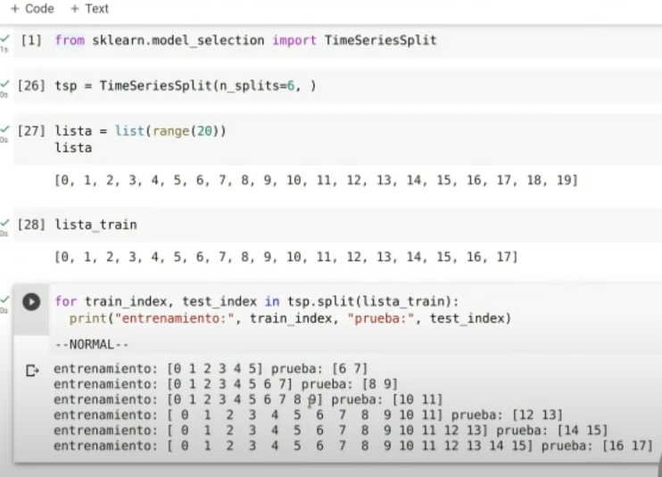

# Sesgo y Varianza
# Validación cruzada

## Series temporales
[YouTube](https://www.youtube.com/watch?v=_0J-a1IQjjQ)
```python
from sklearn.model_selection import TimeSeriesSplit
```



# Metricas de evaluación
- $y_i$ es el valor real
- $\hat{y}_i$ es el valor predicho
- $\bar{y}$ es el promedio de los valores reales
- $n$ es el numero de observaciones

## Eror absoluto maximo (M)
$$ M(y,\hat{y}) = max(|y_i - \hat{y}_i|) $$

Ejemplo: imaginar un dominio donde el modelo es utilizado para calcular el monto de un prestamo a cierta persona, en este caso se quiere saber cual es el error maximo que se puede cometer en el monto del prestamo, es decir que no pase mas alla de cierto valor.
## Error absoluto medio (mean absolute error - MAE)
$$ MAE(y,\hat{y}) = \frac{1}{n} \sum_{i=1}^{n} |y_i - \hat{y}_i| $$
## Error cuadratico medio (mean squared error - MSE)
$$ MSE(y,\hat{y}) = \frac{1}{n} \sum_{i=1}^{n} (y_i - \hat{y}_i)^2 $$

Nota: El error cuadratico medio es mas sensible a los errores grandes que el error absoluto medio, es decir le de mas valor a los errores grandes que los pequeños.

## Raiz del error cuadratico medio (root mean squared error - RMSE)
$$ RMSE(y,\hat{y}) = \sqrt{\frac{1}{n} \sum_{i=1}^{n} (y_i - \hat{y}_i)^2} $$
## Suma residual de cuadrados (residual sum of squares - RSS)
$$ RSS(y,\hat{y}) = \sum_{i=1}^{n} (y_i - \hat{y}_i)^2 $$

## Suma total de cuadrados (total sum of squares - SST)
$$ SST(y) = \sum_{i=1}^{n} (y_i - \bar{y})^2 $$

## R cuadrado (R^2) coeficiente de determinacion
$$ R^2(y,\hat{y}) = 1 - \frac{SSR(y,\hat{y})}{SST(y)} $$
$$ R^2(y,\hat{y}) = 1 - \frac{\sum_{i=1}^{n} (y_i - \hat{y}_i)^2}{\sum_{i=1}^{n} (y_i - \bar{y})^2} $$

Sirve para determinar que tan bien se ajusta el modelo a los datos, es decir que tan bien el modelo explica la variabilidad de los datos. Esta metrica se encuentra entre 0 y 1, donde 0 indica que el modelo no explica la variabilidad de los datos y 1 indica que el modelo explica toda la variabilidad de los datos.

Ademas no aplicar a modelos que no sean de regresion lineal.

El numero de variables independiente aumenta el valor de R^2 aumenta, por lo que se recomienda usar el R^2 ajustado.

## R cuadrado ajustado (R^2 ajustado)
$$ R^2_{ajustado}(y,\hat{y}) = 1 - (1 - R^2) \frac{n-1}{n-p-1} $$

- $n$ es el numero de observaciones
- $p$ es el numero de variables independientes

[vereficar](https://www.youtube.com/watch?v=ZmNDRnmYaPc)

# La Ley de Zipf y las Leyes de Potencias
1. **Ley de Zipf:** Es una ley empírica según la cual en una determinada lengua la frecuencia de aparición de distintas palabras sigue una distribución que puede aproximarse por

$$ P_n \sim \frac{1}{n^a} $$

donde $P_n$ representa la frecuencia de la n-ésima palabra más frecuente y el exponente a es un número real positivo, en general ligeramente superior a 1.

Ejemplo: Esto quiere decir que si en un texto tenemos la palabra "the" que ocurre 4000 veces podemos esperar que la palabra siguiente en frecuencia ocurra 4000/2 veces la siguiente 4000/3 veces etc.

[Idea intuitiva](https://www.youtube.com/watch?v=J8pnE7AeKG4): Usualmetnte aparece cuando hay interrelaciones entre los envetos y/o competencia.

2. Ley de Benford


Distribuciones de probabilidad
1. Pareto (continua):

$$ f(x) = \frac{ab^a}{x^{a+1}} $$


Nota: Cabe señalar que el equivalente discreto de la distribución Pareto es la distribución zeta (la ley de Zipf).

2. Distribucion Normal

$$ f(x) = \frac{1}{\sigma\sqrt{2\pi}}e^{-\frac{1}{2}(\frac{x-\mu}{\sigma})^2} $$

Idea intuitiva: En general aparece cuando ocurren eventos independientes.


# NPL (Natural Processing Languaje)

Problematicas resolver:
- clasificacion: analisis de sentimiento
- entiti recognition: reconocer en el texto entidades, personas,empresas, fechas.
- traduccion


Se puede considerar que los modelos`` Bag of Words (BoW)``, ``Term Frequency (TF)`` y ``Term Frequency-Inverse Document Frequency (TF-IDF)`` como una fase posterior en el procesamiento del lenguaje natural (NLP). Estos modelos se utilizan para convertir el texto en una representación numérica que puede ser interpretada por los algoritmos de machine learning.

Antes de llegar a esta fase, hay varios pasos de preprocesamiento que se deben realizar. Aquí te dejo un orden general de estos pasos:

1. **Limpieza**: Remoción del contenido no deseado³.
2. **Normalización**: Conversión de diferentes formas a una sola³. Esto puede incluir la conversión de todo el texto a minúsculas¹⁶.
3. **Tokenización**: Separación del texto en tokens (unidades mínimas, por ejemplo palabras)³.
4. **Eliminación de Stop Words**: Las palabras de parada o stop words son palabras que se filtran antes o después del procesamiento del texto⁶.
5. **Stemming/Lematización**: Proceso de reducir las palabras inflexionadas a su raíz o base⁶.
6. **Representación Numérica**: En este paso se utiliza BoW, TF, TF-IDF, etc., para convertir el texto en una representación numérica¹.

Es importante mencionar que el **orden exacto** y los pasos específicos pueden variar dependiendo del problema específico de NLP que se esté abordando².

En Python, bibliotecas como NLTK, Scikit-learn y Gensim proporcionan funciones para realizar estos pasos de preprocesamiento¹⁶.


## Tokenización: 
La tokenizacion de que forma separamos un texto en parabras

Existen varios algoritmos de tokenización utilizados en el procesamiento del lenguaje natural. Aquí te menciono algunos:

1. **Tokenización basada en palabras (Word-based)**: Este es el método más sencillo y comúnmente utilizado. Consiste en dividir el texto en palabras utilizando espacios como delimitadores¹.

2. **Penn TreeBank**: Es un método de tokenización basado en reglas que separa los clíticos (palabras que normalmente aparecen solo en combinación con otra palabra), mantiene juntas las palabras con guiones y separa toda la puntuación².

3. **Codificación de pares de bytes (Byte Pair Encoding)**: Este método es útil para tokenizar idiomas como el chino, donde cada carácter puede ser considerado como un token².

Es importante aclarar que **Bag-of-words** no es un algoritmo de tokenización, sino una representación de texto que describe la ocurrencia de palabras dentro de un documento. Se llama "bolsa" de palabras porque cualquier información sobre el orden o la estructura de las palabras en el documento se descarta y el modelo solo se preocupa por si las palabras conocidas ocurren en el documento, no de dónde ocurren en el documento.

En cuanto a las librerías de Python para tokenización, existen varias opciones:

1. **NLTK (Natural Language Toolkit)**: Es una de las bibliotecas más utilizadas para el procesamiento del lenguaje natural en Python. Proporciona funciones para la tokenización, el etiquetado de partes del habla, la extracción de entidades, entre otras.
    - word_tokenize()

2. **Spacy**: Es otra biblioteca popular para el procesamiento del lenguaje natural en Python. Ofrece tokenización rápida y precisa, entre otras características⁸.

3. **Gensim**: Esta biblioteca es conocida por su eficiencia y facilidad de uso. Proporciona implementaciones de varios algoritmos de tokenización⁶.

4. **Keras**: Aunque es más conocida como una biblioteca de aprendizaje profundo, Keras también proporciona utilidades para la tokenización de texto⁷.

5. **Tokenize**: Esta es una librería de Python estándar para tokenizar código fuente Python.


## Extracción de características
Técnicas de extracción de características en el campo del Procesamiento del Lenguaje Natural (NLP). Estas técnicas se utilizan para convertir texto no estructurado en una forma que puede ser interpretada por los algoritmos de machine learning.

- **Bag of Words (BoW)**: Esta técnica se utiliza para convertir texto en un vector numérico. Cada palabra en el texto se considera una característica y el valor de la característica es la frecuencia de la palabra en el texto¹.

- **Term Frequency (TF)**: Es una variación de BoW donde el valor de la característica es la frecuencia de la palabra en el texto³.

- **Term Frequency-Inverse Document Frequency (TF-IDF)**: Es una mejora de la técnica TF. En TF-IDF, el valor de la característica es la frecuencia de la palabra en el texto ajustada por la frecuencia de la palabra en todos los documentos⁴.

En Python, existen varias bibliotecas que implementan estas técnicas:

- **Scikit-learn**: Esta biblioteca proporciona las clases `CountVectorizer` para implementar BoW y `TfidfVectorizer` para implementar TF-IDF⁷.

- **NLTK (Natural Language Toolkit)**: Aunque NLTK es más conocido por sus capacidades de tokenización y etiquetado de partes del habla, también proporciona funcionalidades para calcular TF y TF-IDF¹.

- **Gensim**: Esta biblioteca es conocida por su eficiencia y facilidad de uso. Proporciona implementaciones de varios algoritmos de tokenización y también tiene funcionalidades para calcular TF y TF-IDF¹.
