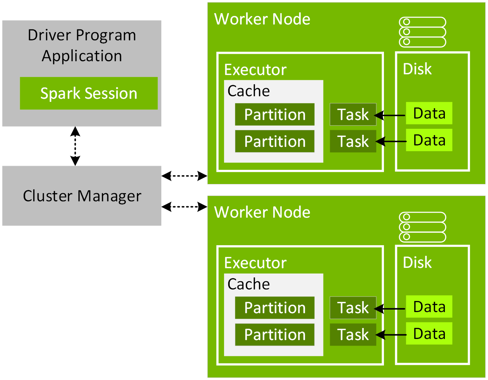
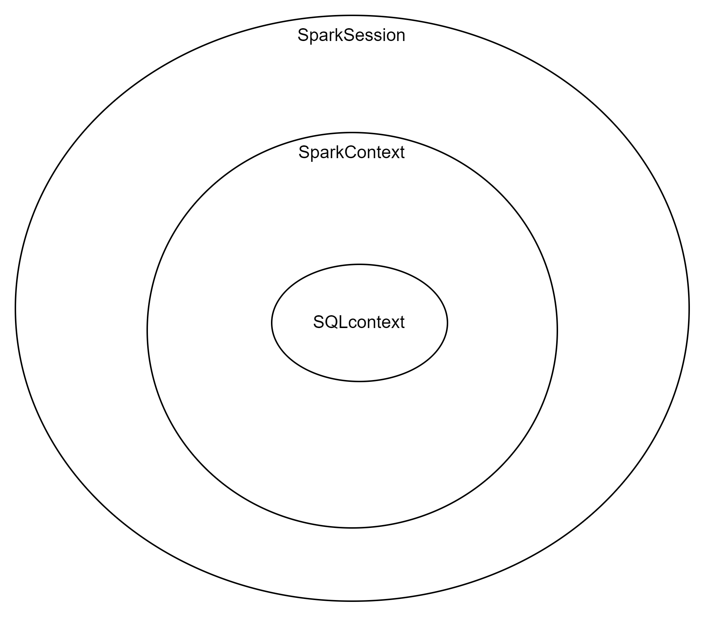

# [Apache Spark](https://medium.com/@ansabiqbal/setting-up-apache-spark-pyspark-on-windows-11-machine-e16b7382624a)

¿Qué es Apache Spark?
Apache Spark es un motor unificado de analíticas para procesar datos a gran escala que integra módulos para SQL, streaming, aprendizaje automático y procesamiento de grafos. Spark se puede ejecutar de forma independiente o en Apache Hadoop, Apache Mesos, Kubernetes, la nube y distintas fuentes de datos.

Muchas veces, no se sabe si utilizar Apache Spark o Apache Hadoop. Ambos están entre los sistemas distribuidos que más destacan en el mercado y ambos son proyectos generales de Apache parecidos que se usan juntos a menudo. Hadoop se emplea principalmente cuando las operaciones exigen un uso intensivo de los discos y siguen el paradigma de MapReduce. Spark es una arquitectura de procesamiento en memoria más flexible y, con frecuencia, más cara. Para decidir cuál te conviene, debes conocer sus características a fondo.

# Spark EcoSystem [SparkEcosystem]

1. **Lenguajes**: Apache Spark proporciona API en varios lenguajes de programación como Scala (el lenguaje nativo), Java, Python y R.

2. **Librerías**: Spark viene con varias librerías integradas que incluyen Spark SQL para consultas SQL y procesamiento de datos estructurados, MLlib para machine learning, GraphX para procesamiento de gráficos y Spark Streaming para procesamiento de datos en tiempo real.

3. **Motor**: El motor de Spark, conocido como Spark Core, es el fundamento sobre el que se construyen todas las demás funcionalidades de Spark.

4. **Gestión**: Apache Spark puede funcionar con varios gestores de clústeres como Hadoop YARN, Apache Mesos y Kubernetes, o incluso en modo independiente.

5. **Almacenamiento**: Spark puede interactuar con una variedad de sistemas de almacenamiento de datos, incluyendo (pero no limitado a) HDFS (Hadoop Distributed File System), Cassandra, HBase, y sistemas de almacenamiento en la nube como Amazon S3.


Cuando programas con Spark:

1. **SparkSession**: En Spark 2.x, SparkSession es el punto de entrada unificado para interactuar con las funcionalidades de Spark.

2. **Elección de API**: Dependiendo de tus necesidades, puedes usar SparkContext para la API Core, SQLContext para la API SQL (aunque en Spark 2.x, puedes usar SparkSession para esto), y StreamingContext para la API de streaming.

3. **Creación de RDDs**: Si eliges SparkContext, puedes crear Resilient Distributed Datasets (RDDs), que son la abstracción de datos fundamental de Spark. Los RDDs se dividen en particiones y se distribuyen a través del clúster, donde pueden ser procesados en paralelo.



[SparkEcosystem]: <https://medium.com/expedia-group-tech/an-introduction-to-apache-spark-f0795f2d5201>

---
La función `parallelize` es una función en SparkContext de PySpark que se utiliza para crear un RDD a partir de una lista de colecciones. Esta función distribuye los datos a través de varios nodos y se utiliza para procesar los datos en el ecosistema Spark.

En cuanto a `SparkSession`, `SparkContext`, `SQLContext` y `StreamingContext`:

- **SparkSession**: Introducido en Spark 2.0, SparkSession tiene como objetivo simplificar la interacción con las diversas funcionalidades de Spark⁷. Es un punto de entrada unificado para DataFrame y Dataset API, Structured Streaming y operaciones SQL⁷. SparkSession encapsula SparkContext y varios otros contextos, como HiveContext y SQLContext, que se utilizaron en versiones anteriores de Spark⁷.

- **SparkContext**: Introducido en Spark 1.0, es el punto de entrada principal para usar las funcionalidades de Spark Core. Conecta el administrador del clúster (como YARN, Mesos o independiente) y coordina los recursos en todo el clúste⁷.

- **SQLContext**: Es una clase y es el punto de entrada para trabajar con datos estructurados (filas y columnas) en Spark y permite la ejecución de consultas SQL⁷.

- **StreamingContext**: Es el punto de entrada principal para la funcionalidad de Spark Streaming¹¹. Un StreamingContext representa la conexión a un clúster de Spark y se puede usar para crear DStream a partir de varias entradas¹¹.

En tu código, `spark = SparkSession.builder.getOrCreate()` crea una SparkSession, `sc = spark.sparkContext` obtiene el SparkContext de la SparkSession y `sqlContext = SQLContext(sc)` crea un SQLContext a partir del SparkContext. Esto se hace porque SparkSession encapsula SparkContext y otros contextos, y puedes obtener estos contextos a partir de la SparkSession⁷. En resumen, SparkSession es un nivel superior a SparkContext, SQLContext y StreamingContext⁷.


# `SparkSession` y `SparkContext` 
Son dos clases diferentes en Spark. 
1. `SparkContext` es la clase principal en Spark que se utiliza para interactuar con el clúster de Spark y crear RDD (Resilient Distributed Datasets). 
2. `SparkSession` es una clase de nivel superior que se utiliza para interactuar con los datos estructurados en Spark, como DataFrames y Datasets. 

En resumen, `SparkSession` es una interfaz más fácil de usar que proporciona una API unificada para trabajar con diferentes tipos de datos en Spark.

2. `SparkContext` es una clase en Spark que se utiliza para interactuar con el clúster de Spark y crear RDD. Es la clase principal en Spark y se utiliza para realizar operaciones de bajo nivel en Spark, como crear RDD, acumuladores y variables de transmisión. 

Por otro lado, `SQLContext` es una clase en Spark que se utiliza para trabajar con datos estructurados en Spark, como DataFrames y Datasets. Proporciona una API para trabajar con datos estructurados y realizar consultas SQL en ellos. A partir de la versión 2.0 de Spark, `SQLContext` ha sido reemplazado por `SparkSession`, que proporciona una API unificada para trabajar con diferentes tipos de datos en Spark.

3. `SparkSession` es una clase de nivel superior que se utiliza para interactuar con los datos estructurados en Spark, como DataFrames y Datasets. Proporciona una API unificada para trabajar con diferentes tipos de datos en Spark, como datos estructurados y no estructurados. A partir de la versión 2.0 de Spark, `SparkSession` ha reemplazado a `SQLContext` y `HiveContext`, que se utilizan para trabajar con datos estructurados en versiones anteriores de Spark.

# SparkSession vs SparkContext: ¿Diferencia básica? [link](https://www.ksolves.com/blog/big-data/spark/sparksession-vs-sparkcontext-what-are-the-differences)
Spark 1.x viene con tres puntos de entrada: `SparkContext` , `SQLContext` y `HiveContext` . Y con la introducción de Spark 2.x, se agregó un nuevo punto de entrada llamado SparkSession. Como resultado, este punto de entrada único combina efectivamente todas las funciones disponibles en los tres contextos antes mencionados. Hagamos la comparación entre SparkSession y SparkContext .

Resumen:
En definitiva SparkSession es un punto de entrada unificado para trabajar con datos estructurados en Spark, mientras que SparkContext es un punto de entrada principal para trabajar con RDD en Spark y SQLContext es un punto de entrada para trabajar con datos estructurados en Spark..
```python
spark = SparkSession.builder.getOrCreate()
sc = spark.sparkContext
sqlContext = SQLContext(sc)
streamingContext = StreamingContext(sc, batchDuration)

```


# Funciones RDD

**Acciones:**
| Funcion | Descripcion |
| --- | --- |
| `count()` | Cuenta el número de elementos en el RDD |
| `collect()` | Devuelve todos los elementos del RDD |
| `first()` | Devuelve el primer elemento del RDD |
| `top(n)` | Devuelve los primeros n elementos del RDD |
| `take(n)` | Devuelve los primeros n elementos del RDD |
| `takeOrdered(n, [ordering])` | Devuelve los primeros n elementos del RDD utilizando la función de ordenación especificada |
| `takeSample(withReplacement, num, [seed])` | Devuelve una muestra aleatoria de elementos del RDD |
| `reduce(func)` | Combina los elementos del RDD utilizando una función func (que toma dos argumentos y devuelve uno). Debe ser func conmutativas y asociativas |
| `CountByKey()` | Devuelve un diccionario de recuento de elementos por clave |

**Transformaciones:**
| Funcion | Descripcion |
| --- | --- |
| `map(func)` | Devuelve un nuevo RDD formado al pasar cada elemento del RDD original a una función func |
| `filter(func)` | Devuelve un nuevo RDD formado al pasar cada elemento del RDD original a una función func y devolviendo los elementos para los que la función devuelve True |
| `flatMap(func)` | Similar a map, pero cada elemento de entrada se puede asignar a cero o más elementos de salida |
| `reduceByKey(func, [numTasks])` | Cuando se llama a un RDD de pares (K, V), devuelve un RDD de pares (K, V) donde los valores para cada clave se combinan utilizando la función de reducción func, que debe ser del tipo (V, V) => V |

**Transformaciones entre dos RDDs:**
| Funcion | Descripcion |
| --- | --- |
| `union(otherRDD)` | Devuelve un nuevo RDD que contiene los elementos de la fuente y el otro RDD |
| `intersection(otherRDD)` | Devuelve un nuevo RDD que contiene la intersección de elementos en la fuente y el otro RDD |
| `subtract(otherRDD)` | Devuelve un nuevo RDD que contiene la diferencia de elementos en la fuente y el otro RDD |
| `join(otherRDD, [numTasks])` | Cuando se llama a un RDD de pares (K, V) y otro RDD de pares (K, W), devuelve un RDD de pares (K, (V, W)) con todos los pares de elementos para cada clave | 

## Acciones
### `groupBy()`
La principal diferencia entre `rdd.groupBy` y `rdd.groupByKey` radica en el tipo de clave utilizada para agrupar los elementos del RDD.

1. `rdd.groupBy(func)`:
   - Se utiliza para agrupar los elementos del RDD en función de una función `func` que toma un elemento del RDD y devuelve una clave.
   - La función `func` se aplica a cada elemento del RDD, y los elementos que tienen la misma clave resultante se agrupan juntos.
   - El resultado es un RDD de pares `(clave, iterador)`, donde la clave es el resultado de aplicar la función `func`, y el iterador contiene los elementos del RDD original que produjeron esa clave.

2. `rdd.groupByKey()`:
   - Se utiliza cuando los elementos del RDD son pares clave-valor `(K, V)`.
   - Los elementos se agrupan por sus claves `K`, de manera que todos los valores `V` asociados a una misma clave `K` se agrupan juntos.
   - El resultado es un RDD de pares `(K, iterador)`, donde `K` es la clave original, y el iterador contiene todos los valores `V` asociados a esa clave `K`.

En resumen, `rdd.groupBy` se utiliza cuando se necesita agrupar los elementos del RDD según una función arbitraria que produce claves, mientras que `rdd.groupByKey` se utiliza cuando los elementos del RDD ya son pares clave-valor, y se desea agrupar por las claves existentes.


### `groupByKey()`
Agrupa los registros para cada clave. Es similar a reduceByKey pero con groupByKey se obtiene todos los registros para cada clave.

Solo se debe utilizar si es necesario la información de cada registro y la cantidad de registros por clave no es demasiado grande.

GroupByKey es una transformación costosa.

Si se desea realizar una agregación, usar reduceByKey. Usar groupByKey para hacer una agregación esta MAL.


1. **`groupByKey`:**
   - La función `groupByKey` agrupa los registros en un RDD según una clave común.
   - Para cada clave única, se obtiene un iterable que contiene todos los registros asociados a esa clave.
   - Es similar a la operación de SQL GROUP BY, donde se agrupan filas por un campo específico.
   - Ejemplo:
     - Supongamos que tenemos un RDD con registros de ventas, donde cada registro tiene una clave (por ejemplo, el ID del producto) y otros datos (como la cantidad vendida).
     - Al aplicar `groupByKey` en función del ID del producto, obtendremos grupos de registros con el mismo ID de producto.

2. **Diferencia con `reduceByKey`:**
   - `reduceByKey` también agrupa registros por clave, pero luego aplica una función de reducción (como suma, promedio, etc.) a los valores asociados a cada clave.
   - En `groupByKey`, no se realiza ninguna operación de reducción; simplemente se agrupan los registros.
   - Por lo tanto, `groupByKey` puede ser menos eficiente que `reduceByKey` en términos de uso de recursos.

3. **Ejemplo:**
   - Supongamos que tenemos un RDD con registros de ventas:
     ```
     ('Producto_A', 100),
     ('Producto_B', 50),
     ('Producto_A', 75),
     ('Producto_B', 30)
     ```
   - Al aplicar `groupByKey`, obtendremos:
     ```
     ('Producto_A', [100, 75]),
     ('Producto_B', [50, 30])
     ```

En resumen, `groupByKey` crea grupos de registros según una clave, sin realizar ninguna operación de reducción. Si necesitas aplicar una función de reducción, es preferible usar `reduceByKey`.
### `reduce(func)`
```python
rdd = sc.parallelize([1, 2, 3, 4])
rdd.reduce(lambda x, y: x + y)
```
`reduce` es una función de PySpark que se utiliza para reducir los elementos de un RDD a un solo valor. En este caso, el RDD contiene los números 1, 2, 3 y 4.

La función lambda que se pasa como argumento a `reduce` toma dos argumentos `x` e `y`, que representan los elementos del RDD en pares sucesivos. En este caso, la función lambda es `lambda x, y: x + y`, lo que significa que la función devuelve la suma de `x` e `y`.

Cuando se llama a `reduce` en el RDD, la función lambda se aplica a los elementos del RDD en pares sucesivos. En el primer paso, `x` es igual a 1 y `y` es igual a 2. La función lambda devuelve la suma de 1 y 2, que es 3. En el segundo paso, `x` es igual a 3 (el resultado del paso anterior) y `y` es igual a 3. La función lambda devuelve la suma de 3 y 3, que es 6. En el tercer paso, `x` es igual a 6 (el resultado del paso anterior) y `y` es igual a 4. La función lambda devuelve la suma de 6 y 4, que es 10.

Por lo tanto, el resultado final de la llamada a `reduce` en el RDD `[1, 2, 3, 4]` con la función lambda `lambda x, y: x + y` es **10**.

### `CountByKey()`
Devuelve un diccionario de recuento de elementos por clave.
En Spark para que un registro sea considerado con clave debe ser una **tupla de dos elementos**, el primer elemento es la key (clave) y el segundo el valor. A su vez, la key y el valor pueden estar compuestos por tuplas, listas, etc.

Cuantos numeros multiplos de 2 hay y cuantos no.
```python
rdd = sc.parallelize([1, 2, 3, 4])
rdd.map(lambda x: (x % 2, 1)).countByKey()
```
El resultado es un diccionario con dos elementos, el primero es la key y el segundo el valor. Cuenta por cada key cuantos valores hay.
```python
(key, value)
(1, 1) 
(0, 1)
(1, 1)
(0, 1)
```

### `ReduceByKey(func)`
La función `reduceByKey` en Spark opera sobre pares clave-valor (en tu ejemplo, los nombres son las claves y los 1s son los valores). Agrupa todos los valores que tienen la misma clave y luego aplica la función que le pasas (en este caso, una función lambda) a esos valores.

En tu ejemplo, si tienes un RDD como este:

```
("jose", 1)
("pepe", 1)
("maria", 1)
("jose", 1)
("maria", 1)
("maria", 1)
```

Y aplicas `reduceByKey(lambda a, b: a + b)`, lo que sucede es lo siguiente:

1. Spark agrupa todos los valores por clave, resultando en algo como esto:

    ```
    "jose": [1, 1]
    "pepe": [1]
    "maria": [1, 1, 1]
    ```

2. Luego, Spark aplica la función lambda `(lambda a, b: a + b)` a cada lista de valores. Esta función toma dos argumentos, `a` y `b`, y devuelve su suma. Spark la aplica a pares de valores hasta que solo queda un valor por clave. Por ejemplo, para "jose", Spark tomaría el primer y segundo valor (ambos 1s), los sumaría (dando 2) y luego reemplazaría los dos 1s en la lista con ese 2. Como no hay más valores en la lista para "jose", Spark se detiene ahí. Para "maria", Spark haría lo mismo, pero como hay tres 1s, tendría que aplicar la función una vez más para sumar el último 1 al 2 que obtuvo de sumar los dos primeros 1s.

3. Al final, te quedas con un RDD que tiene la suma de los valores para cada clave:

```
("jose", 2)
("pepe", 1)
("maria", 3)
```

En PySpark, la función `reduceByKey` siempre opera en pares **clave-valor**, donde la clave es el primer elemento de la tupla y el valor es el segundo elemento. No es posible utilizar tres elementos en la tupla con `reduceByKey`. La razón detrás de esto es que `reduceByKey` se utiliza para aplicar una función de reducción a los valores asociados a cada clave, y esta función debe operar solo en dos valores a la vez.

En resumen:
- `reduceByKey` opera en pares clave-valor (dos elementos en la tupla).
- El primer elemento de la tupla siempre se considera la clave.
- El segundo elemento de la tupla es el valor al que se aplica la función de reducción.

Si necesitas trabajar con más de dos elementos en la tupla, puedes considerar otras operaciones como `groupByKey` o `aggregateByKey`, que permiten manejar más información en cada grupo. 

## Transformaciones
- filter: Si el rdd posee varios columnas, al filtrar se conservan todas las columnas.
- map: Si el rdd posee varias columnas, al mapear se conserva solo la/las columna/s que se esta mapeando.

### `map(func)`
```python
rdd = sc.parallelize([1, 2, 3, 4])
rdd.map(lambda x: x ** 2)

# Resultado
[1, 4, 9, 16]
```
`map` es una función de PySpark que se utiliza para aplicar una función a cada elemento de un RDD. 
La funcion siempre deber tener un unico argumento, pero puede ser una tupla, lista, etc. Puede retornar cualquier cosa.

### `flatMap(func)` 
```python
rdd = sc.parallelize([1, 2, 3, 4])
rdd.flatMap(lambda x: [x, x ** 2])

# Resultado flatMap
[1, 1, 2, 4, 3, 9, 4, 16]

# Resultado map
[[1, 1], [2, 4], [3, 9], [4, 16]]
```
`flatMap` es una función de PySpark que se utiliza para aplicar una función a cada elemento de un RDD y devolver los elementos de la lista de salida como elementos separados.
En conclusión `flatMap` es igual a `map` + `flatten` (aplanar), pero te convierte el resultado a una lista simple.[link](https://www.youtube.com/watch?v=vRy0Vw7KwJQ)

### `sample`

```python
sample(withReplacement, fraction, seed=None)
```

- `withReplacement`: Booleano. Indica si se permite el muestreo con reemplazo, es decir, si un elemento puede ser repetido en la muestra.
- `fraction`: Fracción de elementos a muestrear. Debe ser un valor entre 0 y 1.
- `seed`: Semilla para la generación de números aleatorios.

### `takeSample`

```python
takeSample(withReplacement, num, seed=None)
```

- `withReplacement`: Booleano. Indica si se permite el muestreo con reemplazo, es decir, si un elemento puede ser repetido en la muestra.
- `num`: Número de elementos a muestrear.
- `seed`: Semilla para la generación de números aleatorios.

# Spark: Errores Frecuentes
1. Siempre filtrar antes, tratar de llegar a los rdd chiquitos. Desconfiar si los filtros quedan a lo último.
2. join sin clave o que no tienen nada que ver. Siempre verificar que tengan clave-valor.
3. No chachear inneceariamente.
4. No hacer collect. Solo en casos muy puntuales o cuando se trabaja con pocos datos.
5. Usar takeOrdered en vez de hacerlo con reduce.
6. usar groupByKey en vez de reduceByKey cuando es posible esta muy muy mal. Por que reduceByKey hace el reduce en cada particion y luego hace el reduce de los resultados de cada particion. En cambio groupByKey hace el reduce de todos los elementos de todas las particiones. Por lo tanto, reduceByKey es mucho mas eficiente.
7. llamar a acciones dentro de acciones. Por ejemplo, llamar a un collect dentro de un map. Esto es muy malo por que se ejecuta en cada particion. Por lo tanto, se ejecuta muchas veces.
También llamar a acciones después de acciones. Por ejemplo, llamar a un collect después de un reduceByKey. Esto es muy malo por que se ejecuta en cada particion. Por lo tanto, se ejecuta muchas veces.
8. llamar a una transformación después de una acción. Por ejemplo, pensar que se tiene un rdd cuando enrealidad se tiene un resultado de una acción. Por lo tanto, no se puede hacer una transformación.
9. Realizar opereaciones clave-valor con valores que no son clave-valor. 


## Cache
El método `cache()` en PySpark se utiliza para almacenar en caché un RDD en la memoria para que pueda ser reutilizado en operaciones futuras. Almacenar en caché un RDD en la memoria puede mejorar significativamente el rendimiento de las operaciones que se realizan en ese RDD, ya que evita la necesidad de volver a calcular el RDD cada vez que se realiza una operación en él.

### Ejemplo Propuesto Correcto:
```python
s = r.map(...).cache()
s.filter(...).collect()
s.map(...).reduce(...)
```

### Explicación Paso a Paso:

1. **Transformación y Cache**:
   ```python
   s = r.map(...).cache()
   ```
   Aquí se aplica una transformación `map` al RDD `r` y se cachea el resultado en el RDD `s`. Esto marca el RDD `s` para que sea almacenado en la memoria después de su primera evaluación.

2. **Acción para Materializar el RDD Cacheado**:
   ```python
   s.filter(...).collect()
   ```
   En esta línea, se aplica una transformación `filter` seguida de una acción `collect`. La acción `collect` desencadena la evaluación del RDD `s`, materializándolo y almacenándolo en la memoria. Esto es crucial porque garantiza que `s` se cachee correctamente.

3. **Uso del RDD Cacheado**:
   ```python
   s.map(...).reduce(...)
   ```
   Ahora que `s` está cacheado, cualquier operación subsiguiente, como `map` seguida de `reduce`, se ejecutará utilizando el RDD cacheado, evitando recalcular el RDD original `r` y mejorando la eficiencia.

### Comparación con el Ejemplo Incorrecto:

Anteriormente, el uso era:

```python
s = r.map(...).cache()
s.map(...).reduce(...)
```

### Problemas del Ejemplo Incorrecto:

1. **Cache sin Acción Inmediata**:
   En este caso, `cache()` se llama, pero no hay una acción inmediata para materializar el RDD `s`. Esto significa que `s` no se almacenará en la memoria hasta que una acción se ejecute.

2. **Evaluación Perezosa**:
   Debido a la evaluación perezosa de PySpark, las transformaciones no se ejecutan inmediatamente. Sin una acción después de `cache()`, la caché no tendrá efecto.

### Por Qué el Nuevo Ejemplo es Correcto:

En el nuevo ejemplo, se garantiza que `s` se cachea efectivamente porque se realiza una acción (`collect`) después de la llamada a `cache()`. Esto materializa el RDD y lo almacena en la memoria, asegurando que las operaciones subsecuentes utilicen el RDD cacheado en lugar de recalcularlo desde `r`.

### Conclusión:

El nuevo ejemplo sigue las mejores prácticas para el uso de `cache()` en PySpark:

1. Marca el RDD para caché con `cache()`.
2. Realiza una **acción** para materializar y almacenar el RDD en la memoria.
3. Utiliza el RDD cacheado en operaciones posteriores para mejorar el rendimiento.

Siguiendo estos pasos, se asegura que el RDD cacheado se use eficientemente, evitando recalculaciones innecesarias y optimizando el rendimiento de la aplicación.